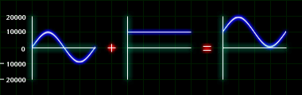
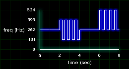
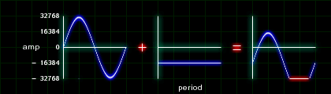

# Bias

Before you go off learning neural nets or building algorithmic drum machines, first consider learning about bias. What is bias? It's adding a constant value to your signal. Bias is so easy to do, you'll be able to do it your first try. If you can add and subtract, you already know how to do it. If you can compile a Csound score, better than house odds you can add and subtract.

## The Phantom Bias

In this first example, we'll bias a sine wave. Take the output of an OSCIL generating a sine wave with an amplitude of 10000 and frequency 440hz and add a constant value of 10000.

aosc = aosc + ibias.

Figure 1.1 shows the results. Notice that the end result is still a sine wave, but has only moved its vertical position.



Now listen to it. First you'll hear an unbiased signal, then the biased signal. Listen for any audible differences.

```csound
101.orc

instr 1
ibias = p4

 aosc oscil 10000, 440, 1
 aosc =	aosc + ibias
 out aosc
endin

101.sco

f1 0 8192 10 1

i1 0 2 0
i1 3 2 10000
```

Did you hear a difference between the two signals? If you did, you have better ears than I. There should be no audible difference. Just try to realize that your signal has been modified.

## Biased Control Signal

Lets take the same technique and apply it to a control signal. A 220Hz sine wave is biased by adding the value of p4 and is used to modulate the amplitude of a 440Hz sine wave. The signal is biased by 0, 10000 and 20000.

In this listening example, you'll hear a difference.

```csound
; 102.orc

instr 1
ibias = p4
 aosc1 oscil 10000, 220, 1
 aosc1 = aosc1 + ibias
 aosc2 oscil aosc, 4401, 1
 out aosc2
endin

102.sco

f1 0 8192 10 1

i1 0 2 0
i1 3 2 10000
i1 6 2 20000
```

Instead of using a bias, use an envelope to evolve the timbre. Go ahead... Try it!

## Pitch and Trills

Instead of modulating the amplitude of a sine wave, lets modulate the pitch. Instead of using a sine wave as our modulator, I'm using a square wave to create a trill. The unbiased signal will lose its pitch center between the highest frequency and lowest frequency. The biased trill maintains the pitch as the bottom frequency.



```csound

; 103.orc

instr 1
 aosc1 oscil 10000, 262, 1
 out aosc1
endin

instr 2
ibias = p4
 kosc1  oscil .5, 4, 2
 kosc1  = kosc1 + ibias
 aosc1  oscil 10000, 262 + (262 * kosc1), 1
 out aosc1
endin

; 103.sco

f1 0 8192 10 1
f2 0 2 -2 1 -1

i1 0 2
i2 2 2 0

i1 4 2
i2 6 2 .5
```

## Too Much Bias

In a 16-bit sound file, you have an amplitude range of -32768 to 32768. When you bias your audio signals, make sure not to over do it. For instance, if you had a sine at its maximum possible amplitude, adding any bias will cause the signal to get hard clipped. In figure 1.3, we have such a case. Adding -16384 to the wave causes the bottom to square off, also known as digital clipping.



```csound
; 104.orc

instr 1
 aosc1 oscil 32768, 440, 1
 aosc1 = aosc1 + -16384
 out aosc1
endin

104.sco

f1 0 8192 10 1

i1 0 4
```
