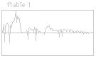
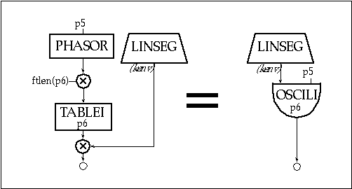

# Understanding and Using Csound’s GEN Routines

Jon Christopher Nelson

Csound utilizes lookup tables for musical applications as diverse as wavetable synthesis, waveshaping, mapping MIDI note numbers and storing ordered pitch class sets. These function tables (f-tables) contain everything from periodic waveforms to arbitrary polynomials and randomly generated values. The specific data is created with Csound's f-table generator subroutines, or GEN routines. Csound includes a family of GEN routines that write sampled soundfiles to a table, sum sinusoidal waves, draw lines and curves between specified points, create Chebyshev polynomials, calculate window functions, plot individual points in a table and generate random values. This tutorial surveys the Csound f-table generators, interspersing suggestions for efficient and powerful f-table utilization in Csound, including the introduction of a new technique for generating three-dimensional wave terrain synthesis f-tables.

A Csound f-table is an array of floating point values calculated by one of the GEN routines and stored in RAM for use while Csound generates sound. These f-tables are traditionally specified in the Csound score file and are generally restricted in size to lengths of a power of two (2n) or a power of two plus one (2n + 1). An f-table with a size of 1024 (210) will contain floating point values in a collection of sequential data storage locations with data addresses numbering from 0 to 1023. Tables can be visually displayed as mathematical graphs with data addresses plotted from left to right along the horizontal, or x-axis (abscissa values) and the actual stored data plotted along the vertical, or y-axis (ordinate values) as shown in figure 2.1.


Figure 2.1 A close up of a 129 point function table focusing on the data in addresses 63 - 67.

An f-table outputs the data stored at the given address when it receives an input index value. In Csound, f-tables receive isolated indexes as well as streams of index values that scan tables once, periodically or randomly. Although f-tables are defined by score file GEN routines, a variety of orchestra file opcodes create index values and access table data. For example, the oscil opcode repeatedly generates index values from 0 to 1023 as it periodically scans a 1024-point f-table, an operation called wrap-around lookup. Orchestra file opcodes that include the suffix "i" have the added capability of linearly interpolating between successive table values. This feature effectively provides an audio smoothing function. For example, periodically scanning a 512-point f-table with a 43 Hz oscil opcode at a 44.1 kHz sampling rate reaps approximately two copies of each point in the f-table. In contrast, the oscili opcode interpolates between each of these values as shown in figure 2.2. Other interpolating opcodes include tablei, oscil1i, foscili and randi.


Figure 2.2 A comparison of a non-interpolating and an interpolating oscillator opcode.

## The Extended Guard Point

Although Csound f-table sizes are defined as either 2n or 2n + 1, the space allocation for each f-table array is always 2n + 1, providing an extended guard point at the end of each table. If the requested table size is 2n, the extended guard point contains a duplicate of the first value of the f-table. If the requested size is 2n + 1, the guard point contains the final value of the requested function. The reason for explicitly defining an extended guard point is because Csound opcodes utilizing a 512-point table only send indexes from 0 to 511 (making the extended guard point seem superfluous), however, interpolating opcodes use the extended guard point value to calculate interpolation values after index 511. As a result, interpolating wrap-around lookup opcodes (oscili, foscili and phasor -tablei pairs) should scan 2n size f-tables. This ensures smooth interpolation between the table end points since the extended guard point will be a copy of the first table value. In contrast, interpolating single scan opcodes (oscili and envlpx) should scan f-tables with a 2n + 1 size. For example, the envlpx opcode scans a f-table to determine the rise shape of the attack portion of an envelope. If it scans a table with a 2n size, the extended guard point will contain the first table value. If this attack is slow, the envlpx opcode will interpolate between the last table value and the starting table value, creating an amplitude discontinuity that could result in an audible click. However, using a table size of 2n + 1 ensures that the interpolation will create a smooth amplitude envelope transition between the attack and the pseudo-steady state.

## Score F-Statements

The Csound GEN routines are specified by a function, or "f-statements" in the score file. A Csound score may contain hundreds of f-statements, each with many parameters. A prototypical f-statement appears as follows:

```f  p1  p2  p3  p4  p5 . . .```

While parameter numbers 5 and higher specify different f-table attributes for different GEN routines, the first four parameters determine the following qualities for all GEN routines:

- p1 = a unique f-table identification number
- p2 = f-statement initialization time expressed in score beats
- p3 = f-table size
- p4 = GEN routine called to create the f-table

Orchestra file opcodes point to f-tables with arguments containing f-statement identification numbers, or p1 values. A negative p1 value in a score file f-statement deletes the f-table sharing the same positive p1 value at a specified p2 time. For example, the f-statement:

```f  -8  132```

will delete f-table 8 at beat 132 of the score. This provides a means of managing a computer's limited RAM while performing a score file containing numerous or large f-tables.

Furthermore, a p1 value of 0 creates a null table that can be used to generate silence at the end of a soundfile. For example, a solitary:

```f  0  60```

in a score file creates a soundfile with sixty seconds of silence. This statement can also be used to turn on Csound, enabling the reception of MIDI data for one minute of real-time synthesis.

In addition to specifying the desired f-table GEN subroutine, p4 values determine whether or not the function will be scaled. A positive p4 value results in a table that is post-normalized to ordinate values between -1 and 1. Default f-table normalization facilitates more predictable control in applications such as wavetable or non-linear synthesis. A negative p4 value inhibits rescaling and should be used for f-table applications requiring raw data, such as storing head-related transfer functions, algorithmic compositional data or MIDI mapping functions.

## The GEN Routines

### Reading Sampled Sounds into Function Tables with GEN1

Csound enables sound designers to manipulate and transform sampled sounds in a variety of ways. Soundfile filtering, amplitude modulation, waveshaping and panning are all possible using the soundin opcode in the orchestra file. However, manipulations such as transposing or frequency modulating soundfiles necessitates writing the soundfile into an f-table. The GEN1 f-statement stores soundfiles in tables and is written as follows:

```f #  time  size  1  filecode  skiptime  format```

The filecode value in p5 can be an integer or a file name in quotation marks. A p5 value of 33 reads the soundfile entitled soundin.33 from the SFDIR into the f-table while the p5 entry "great.snd" loads the soundfile entitled great.snd into the f-table. Csound reads soundfiles from the beginning and reads the sample format from the soundfile header unless a skiptime and format are specified in p6 and p7.



Figure 2.3 The f-table display for the soundfile "great.snd" as read into Csound via GEN1.

### GEN1

GEN1 is the only GEN routine that allows a table size of 0. In this case, the number of samples in the soundfile determines the table size. However, these tables can only be read by the loscil opcode. Although loscil provides sample playback with transposition and loops, it cannot start at a specified skip time into the table or read the table backwards. These manipulations are possible only if the soundfile is written into a GEN1 table with a 2n or 2n + 1 size. Using these table sizes will probably result in either soundfile truncation or extension with zero values. However, any opcode that calls an f-table will be able to read these soundfiles. In figure 2.4 we see a flowchart of a Csound instrument that reads a tabled soundfile using a line opcode to provide table lookup values. The accompanying lines of orchestra and score code provide the Csound implementation of this instrument.


Figure 2.4 Block diagram of instr 201, a soundfile reading instrument using a tablei opcode

```csound
  instr  201                       ; reading a soundfile using TAblei & Gen1
iskip = int(p5*sr)                 ; starting sample in seconds
ilast = int(sr*p3*p6)+iskip        ; ending sample in w/ transpose
kenv  linseg 0,  .05,  p4,  p3-.05,  p4,  .02,  0
aread  line ; a-rate table index
;aread line ilast, p3, iskip       ; ilast to iskip: backwards!
asnd  tablei  aread, 1             ; scans ftable 1
asig = asnd*kenv                   ; imposes envelope
   out asig
   endin

f  1  0  262144  1  "speech1.aif"  0  4  0  ; reads and normalizes
```

In this example, the audio rate line segment aread is drawn from a starting sample iskip to an ending sample ilast. The starting sample is calculated by multiplying the sampling rate with the desired skip time (p5). Similarly, the final sample is determined by first multiplying the sampling rate, note duration (p3) and a transposition factor (p6) and then adding the result to iskip. The line segment aread provides the index into the raw soundfile data stored in f-table 30, which must have a 2n size. Multiplying asnd with kenv, whose peak amp is determined by an amplitude multiplier value (p4), imposes an amplitude envelope on this soundfile segment. You might try adding an oscillator to the aread value in this example to create an FM instrument.

Normalized soundfiles may be best for some sound playback and processing techniques while raw amplitude data is best for others. Using f-statement p4 values of +1 and -1 respectively generates normalized and raw tables containing the same soundfile. In the example code above, raw sample data is read into f-table 1 and then normalized to allow for amplitude scaling by the linseg envelope.

## Sinusoidal Wave Generators

Csound also includes function generators that add sets of sinusoidal waves to create composite waveforms. In Csound, single 2¹ periods of summed sinusoids are written into f-tables by the GEN10, GEN9, GEN19 and GEN11 subroutines. These GEN routines facilitate the creation of sine, cosine, square, sawtooth, triangle and pulse waveforms, which have direct applications as waveshapes for wavetable synthesis. Periodically cycling through these tables with wrap-around lookup opcodes generates a periodic waveform.


Figure 2.6 F-table display for simple geometric waveshapes - sine, saw, square and pulse generated using Csound’s GEN10 subroutine.

### GEN10

GEN10, GEN9 and GEN19 all create composite waveforms by summing sine waves with specified relative strengths. Of these, GEN10 adds harmonic partials that are all in phase. The relative strengths of ascending harmonic partials (1, 2, 3, etc.) are defined in parameter numbers, p5, p6 and p7 respectively. Figure 2.7 shows a flowchart for two equivalent oscillators, followed by their accompanying orchestra file and score file code containing a few simple GEN10 wave recipes.



Figure 2.7 Block diagram of instr 202 and 203, table-lookup oscillator instruments realized via the phasor and tablei opcodes and an interpolating table-lookup oscillator.

```csound
        instr    202             ; table-lookup oscillator - phasor/tablei
kenv    linseg   0,  .05,  p4,  p3-.1,  p4*.8,  .05,  0
aphase  phasor   p5              ; phases 0-1 p5 times-per-second
ilength =        ftlen(p6)       ; determine length of f-table
aphase  =        aphase*ilength  ; step through entire table
asig    tablei   aphase, p6      ; read table number from p6
        out      asig*kenv       ; impose envelope
        endin

  instr  203 ; table-lookup oscillator - Oscili
kenv  linseg  0,  .05,  p4,  p3-.1,  p4*.8,  .05,  0
asig  oscili  kenv,  p5,  p6
  out asig
   endin
```

Figure 2.8 Orchestra code for instr 202 and instr 203, table-lookup oscillator instruments using a phasor/tablei pair versus an oscili.

```csound
; F-Table code for simple geometric waveforms as illustrated in figure 2.6.

; 8192 point sine
f 2  0  8192  10  1

; sawtooth wave – all harmonics (through 13th) at a strength of 1/harmonic#
f 3  0  513  10  1  .5  .333  .25  .2  .166  .143  .125  .111  .1  .0909  .0833  .077

; square wave – odd harmonics (through 17th) at a strength of 1/harmonic#
f 4  0  513  10  1  0  .333  0  .2  0  .143  0  .111  0  .0909  0  .077  0  .0666  0  .0588

; pulse (trumpet?)
f 5  0  513  10  .8  .9  .95  .96  1  .91  .8  .75  .6  .42  .5  .4  .33  .28  .2  .15
```

### GEN9

Like GEN10, GEN9 creates composite waveforms by adding partials with specified relative strengths. However, GEN9 can create enharmonic partials with unique phase dispositions.


Figure 2.10 F-table displays for three waveforms generated using GEN9 — a cosine, a triangle and a half-sine.

The partial number, strength and phase are defined in groups of three parameters beginning with p5. Here are a few more wave recipes that can be generated with GEN9:

```csound

; F-table code for cosine, triangle and half sine as illustrated in figure 2.10.

; cosine wave (sine wave with initial phase of 90 degrees):
f 6  0  8192  9  1  1  90

; triangle wave (odd harmonics at a strength of 1/harmonic
; number with inverted phase for every other harmonic):

f 7  0  513  9  1  1  0  3  .333  180  5  .2  0  7  .143  180  9  .111  0

; half of a sine:
f 8  0  513  9  .5  1  0
```

Figure 2.11 F-table code for cosine, triangle and half sine as illustrated in figure 2.10.

Unlike orchestra opcodes that specify phase as a fraction of a cycle (0-1), score f-statements express phase in degrees (0-360). In addition, the partial number does not have to be an integer. Consequently, specifying partial number .5 in f 8 above generates half of a sine wave, which could be used as an envelope, frequency multiplier, or a table for waveshaping.

### GEN19

GEN19 extends GEN9 by adding a DC offset parameter. Beginning with p5 in the f-statement, the partial number, relative strength, initial phase and DC offset are specified in groups of four parameters. Figure 2.12 shows an f-table display and score code to generate a quasi-Guassian curve that rises from 0 to 1.

```f 9 0  1024 -19  1 .5 270 .5```


Figure 2.12 Score code and f-table display for a quasi-Gaussian curve generated using GEN19.

The DC offset will add .5 to the ordinate values of this sine wave. As a result, these unscaled (-p4) values will span from 0 to 1 rather than from -.5 to .5. This provides a good grain envelope for granular synthesis instruments, or this function could serve as an amplitude multiplier that controls both left-right and front-back panning in a four channel soundfile. Or these same values could provide table indexes into f-tables containing head-related transfer function data for controlling dynamic filters and reverb times for virtual reality applications.

## Enharmonic Partials

Although GEN9 and GEN19 can create enharmonic (non-integer) partials, only partials that are either integers or .5 multiples should be used for wrap-around lookup operations. Other enharmonic partials typically generate non-zero values at the end of the f-table, creating discontinuities and resultant noise. Reducing the detuned partial’s relative strength can diminish discontinuities. Moreover, paired partials with complementary offsets and equal strengths will eradicate discontinuities. For example, partials x.75 and y.25, where x and y are positive integers will exhibit equivalent positive and negative ordinate values at the end of the f-table. Summing these values results in a final table ordinate value of 0 so no discontinuity exists during wrap-around lookup. Similarly, partials x.66 and y.33, x.2 and y.8 and x.79 and y.21 will also "zero out" at the end of the f-table. Pairs of equal strength partials with shared offsets and inverse phase relationships also avoid final table discontinuities. For example, partials x.9 and y.9, where x and y are unequal positive integers, with shared strengths and respective initial phases of 0 and 180 will add up to 0 at the end of the table. The f-tables in figure 2.14 exhibit sums of 0 at their end points, demonstrate cycle offset and phase inversion cancellation.


Figure 2.13 F-table display for enharmonic spectra without discontinuities.

```csound
; F-table code for enharmonic partial functions without discontinuities.

f 10  0  8192  9  .75   1  0  2.25  1  0    ; cycle offset cancellation
f 11  0  8192  9  1.66  1  0  3.33  1  0    ; cycle offset cancellation
f 12  0  8192  9  1.25  1  0  4.25  1  180  ; inverse phase cancellation
```

Although these enharmonic partial pairing strategies eliminate discontinuities, they will not result in periodic phasing of detuned partials. Periodic phasing is only achieved by generating a table containing summed high harmonic partials with complex relationships. This results in a f-table with inherent phasing relationships.

While utilizing this type of enharmonic function, a desired fundamental frequency is generated by dividing the desired oscillator rate by the lowest harmonic number present in the function. For example, an f-table containing harmonic partial numbers 21, 22, 25, 27, 31, 33, 34 and 35 should be read with the oscili opcode's cps argument set to the desired frequency divided by 21, the lowest partial present. Since this will often result in a low oscillator frequency that scans the table slowly, it is best to use a large table with an interpolating oscili opcode.


Figure 2.15 Block diagram of instr 204, a simple oscillator instrument with "desired" pitch computed as cpspch(p5)/21 (i.e. the lowest partial).

```csound
; Orchestra and f-table code for oscillator instrument with high order partials illustrated in figure 2.17.
      instr   204 ; simple w/ cpspch pitch converter
ifrq  =       cpspch(p5)
kenv  linseg  0,    .05,     p4, p3-.1, p4*.8, .05, 0
asig  oscili  kenv, ifrq/21, 13
      out     asig
      endin

f 13  0   8192  9  21  1  0  22  1  0  25  1  0  27  1  0  31  1  0  33  1  0  34  1  0  35  1  0
```


Figure 2.17 F-table display for high-order enharmonic partials as defined by f 13 in figure 2.16.

The phasing relationship in this f-table is still non-dynamic. Dynamic phasing is only achieved through mixing multiple oscillators with enharmonic relationships in an orchestra instrument.

### GEN11

Unlike GEN10, GEN9 and GEN19, GEN11 adds cosine partials instead of sines. As shown in figure 2.18, this GEN routine is designed to generate pulse trains with the number of harmonics, the lowest harmonic and an amplitude coefficient specified in p5, p6 and p7 of the f-statement.

```csound
; score code for pulse-train generated using GEN11
f 14  0  4096  11  10  1  .
```

Although f 14 above creates a pulse train by summing sines, GEN11 generates pulse-trains with fewer parameters. It also calculates the relative amplitudes according to an exponential strength coefficient. However, GEN11 pulse trains are non-dynamic. For dynamic pulse-trains use the buzz and gbuzz opcodes.

## Drawing Segments

### GEN7

Csound also includes four GEN routines that draw lines and curves between specified points. For each of these, the odd-numbered parameters (p5, p7 and p9 ) and even-numbered parameters (p6, p8, p10), contain ordinate and segment length values respectively. Figure 2.18 illustrates a few waveforms that use GEN7 to draw line segments.


Figure 2.19 F-table display for linear waveforms drawn with GEN7.

f 15  0  512  7  1  512 -1                ; sawtooth
f 16  0  1024 7  1  512  1  0  -1 512 -1  ; square
f 17  0  512  7  -1 100 -1  312 1 100  1  ; for waveshaping
f 18  0  128  7  1  1    1  0   0         ; a single impulse


Figure 2.20 F-table code for simple waveshape drawn with GEN7 and shown in figure 2.19.

Segment lengths are expressed as table points and values of 0 result in discontinuities. Furthermore, segment lengths generally should add up to the table length. Segment length sums greater than or less than the table length truncate the function or pad the table with zeros respectively.

### GEN5

The GEN5 parameters are identical to those of GEN7. However, since GEN5 draws exponential segments, only non-zero ordinate values are allowed. Figure 2.21 shows the a typical example of GEN5 used to draw and exponential envelope function.

```f 19  0  1024  5  .001  100  1  824  .75  100  .001```


Figure 2.21 F-table display and score code of an exponential envelope function drawn with GEN5.

### GEN8

Although GEN8 creates very smooth cubic spline curves, using two equal ordinates separated by a short segment length results in large humps. Figure 2.22 shows a couple of typical GEN8 f-tables.

```csound
; quasi-guassian
f  20  0  513   8  0 150 0.5 50   1 113 1 50  0.5 150 0

; stretched cosine
f  21  0  2048  8  1 750 0   550 -1 400 0 348 1
```


Figure 2.22 F-table display and score code for two spline curves drawn with GEN8, a quasi-Gaussian and a stretched cosine.

With a table length of 513, the quasi-Guassian curve in f 20 works well for single scan operations.

### GEN6

Unlike the other segment drawing GEN routines, GEN6 requires groupings of three ordinate values separated by intermediary length values to calculate a cubic polynomial function segment. Here, the third ordinate value becomes the first in the next grouping of three. These cubic polynomial segments are relatively smooth if the odd numbered ordinates oscillate between maximum and minimum values while the even ordinates, the points of inflection, maintain somewhat linear relationships between the odd ordinates. Successive maxima or minima odd ordinate values or points of inflection without linear relationships result in segment spikes.

```csound
; smooth
f  22   0   8193   6   0  2048 .5  2048  1 2048 0  2049 -1

; points of inflection are not between odd ordinate values
f  23   0   8193   6   0  2048 1   2048 -1 2048 1  2049 0

; successive maxima
f  24   0   1024   6   0  256 .25  256  .5 256 .75  256 1
```


Figure 2.23 F-table display and score code for 3 cubic polynomial functions.

### Waveshaping Function Tables

GEN3, GEN13, GEN14 and GEN15 all create polynomial functions that can be used effectively in waveshaping instruments. Of these, GEN3 is the most flexible since it creates a polynomial function over any left (p5) and right (p6) ordinate values with any number of specified coefficients in p7 and higher. Figure 2.24 shows a typical example.

```f 25  0  1025  3  -1  1  5  2  4  1  3  1  2  1```


Figure 2.24 F-table display and score code for a polynomial function drawn with GEN3.

GEN13, GEN14 and GEN15, on the other hand, create specific types of functions known as Chebyshev polynomials. Chebyshev polynomials can split a sinusoid into harmonic partials in a waveshaping instrument. GEN13 and GEN14 f-statements specify the relative strengths of harmonic partials to generate Chebyshev polynomials of the first and second kind respectively. Specifying the phase of each harmonic with GEN15 generates two f-tables that can be used in a phase quadrature instrument.

The tables generated with this family of GEN routines have bipolar structures with origins located at the midpoint of the table. Consequently, it is best to use a table length of 2n + 1. Waveshaping typically uses a sine wave to provide lookup indexes to one of these tables. If the waveshaping f-table-length equals the waveform resolution (16 bit = 216 = 65536), linear mapping results. A flowchart for a waveshaping instrument can be seen below. The essential lines of Csound code for this instrument with a simple waveshaping f-table accompany this figure.


Figure 2.25 Block diagram of instr 205, a simple waveshaping instrument with normalization.

```csound
; Orchestra and f-table code for simple waveshaping instrument, instr 205.

   instr  205 ; a simple waveshaping
ksweep  linseg  0, p3*.5, .49, p3*.5, 0   ; index sweep function
aindex  oscili  ksweep, p5, 2             ; sound to waveshape
atable  tablei  aindex, 26, 1, .5         ; waveshape aindex
knorm   tablei  ksweep*2, 27, 1           ; make normalization function
kenv    linen   p4, .01, p3, .02          ; amplitude envelope
   out  (atable*knorm)*kenv               ; normalize and impose envelope
   endin

f 26  0  1025  7  -1  256 -1 513 1 256 1   ; waveshaping function
f 27  0  513   4  26  1                    ; amp normalizing function
```


Figure 2.27 F-table displays of waveshaping function drawn with GEN7 and normalizing function drawn with GEN4 as defined in figure 2.26.

In this example, a 440 Hz sine oscillator provides the index to the table with a ramping envelope that reaches a peak amplitude of .49. These sinusoidal amplitude values (y-axis of f 2) provide the lookup indexes (x-axis) into f-table number 26. The atable tablei opcode sets the table mode at 1, normalizing the table length to x-axis, or abscissa values between 0 and 1. Since the table has a bipolar structure, this tablei opcode also has a table offset of .5. This offset value is added to the aindex values, resulting in table indexes that oscillate around the midpoint of the waveshaping function. When the ksweep values that in turn dictate the aindex amplitude reach .49, the index values oscillate between .01 and .99, scanning the entire waveshaping function.

Since f 26 contains a line segment from -1 to +1 over the middle section of the table, the sinusoidal index values generate a sinusoidal wave when the ksweep values are below .25. As ksweep exceeds .25 throughout the middle section of each note, all aindex values less than -.25 and greater than .25 will reap f-table values of -1 and 1 respectively. This non-linear waveshaping simulates amplifier distortion in which loud input signals are clipped, introducing numerous high partials into the sound. Another possible amplifier distortion model might use GEN9 to create a waveshaping function containing half of a sine wave with an initial phase disposition of 270 degrees.

## Waveshaping Amplitude Normalization with GEN4

Clearly, adjusting the range of periodic index values to a waveshaping f-table provides a powerful means of dynamic signal modification, but it also directly alters the amplitude of the sound. For instances in which this causal relationship is undesirable, the waveshaped f-table output must be normalized to exhibit a consistent peak value before imposing an amplitude envelope. The GEN4 subroutine provides the means to accomplish this task by analyzing a waveshaping function and creating a complementary amplitude normalization f-table. Multiplying the outputs of a waveshaping f-table and its complementary GEN4 normalizing f-table generates a waveshaped signal with a consistent peak amplitude value if the sweep function determines the index for both tables. An amplitude envelope can then be imposed on the resultant signal. This technique can be used to create paradoxical sounds in which the non-linear distortion has no relationship to the amplitude. For example, inversely related sweep and amplitude envelopes can generate a sound that distorts more as the amplitude diminishes.

In instr 205 illustrated above, f 27 uses GEN4 to analyze f 26 and create a normalizing function. The GEN4 f-statement specifies the f-table number to analyze in p5 and defines the table mode in p6. Any non-zero value in p6 will perform the analysis, assuming the waveshaping function has a bipolar structure. This bipolar analysis data must be written into a table that is half the size of the waveshaping f-table. A p6 value of zero analyzes a function that scans from left to right. In this case, both the waveshaping and normalizing tables must be the same size.

### GEN13 and GEN14

Although any GEN routine can create waveshaping functions, Chebyshev polynomials provide more predictable waveshaping results by splitting waves into harmonic partials with specified relative strengths. As the periodic index values increase, the resultant Chebyshev polynomial f-table output generally adds the specified partials in ascending order. GEN14 creates a slightly gentler curve than GEN13 but the resultant waveshaped signals sound very similar. Specifying strengths of more than 20 harmonics in either GEN13 or GEN14 reaps great distortion as the index values approach the table length limits. For both GEN13 and GEN14, the Chebyshev polynomial is drawn over ordinate values that span from -p5 to +p5 f-statement values while p6 defines an amplitude scaling factor that is applied to any index into the table. Utilizing a table opcode offset argument of .5 and an f-statement p6 value of .5 provides a simple means of scaling a normalized periodic index. The relative strengths of harmonic partials are defined in p7 and following. Figure 2.28 defines some typical spectra using GEN13 and GEN14.

```csound
   instr 206 ; waveshaping with normalization
iwshpfun = p6
inormfun = p7
ksweep  linseg  0, p3*.5, .49, p3*.5, 0   ; index sweep function
aindex  oscili  ksweep, p5, 2             ; sound to waveshape
atable  tablei  aindex, iwshpfun, 1, .5   ; waveshape aindex
knorm   tablei  ksweep*2, inormfun, 1     ; make normalization function
kenv    linen  p4, .01, p3, .02           ; amplitude envelope
asig  =  (atable*knorm)*kenv              ; normalize and impose env
  out asig
  dispfft asig, .1, 1024
  endin

; 8192 point sine
f  2  0  8192  10  1
; waveshaping function: GEN13 - odd harmonics
f 28 0 4097  13  1  1  1  0  .8  0  .5  0  .2
; amp normalizing function
f 280 0  2049  4  28  1
; waveshaping function: GEN14 - same harmonics
f 29  0  4097  14  1  1  1  0  .8  0  .5  0  .2
; amp normalizing function
f 290  0  2049  4  29 1
; waveshaping function: GEN14 - even harmonics
f 30 0  4097  14  1  1  0  1  0  .6  0  .4  0  .1
; amp normalizing function
f 300  0  2049  4  30  1
; waveshaping function: GEN 13 - over 20 harmonics
f 31  0  4097  13  1  1  1  .666  .5  .3  0  0  .3  0  .2  .25  .33  0  0  .1  0  .45  .33  .2  .1  .1  .15
; amp normalizing function
f 310 0  2049  4   31 1
```

Figure 2.28 Orchestra and f-table code for instr 206, a simple waveshaping instrument with normalization which uses Chebyshev polynomials of first (GEN13) and second (GEN14) kind to allow the specification of specific and definable harmonic partials and amplitudes under waveshaping.


Figure 2.29 Four f-table displays of waveshaping functions for odd harmonics (f 28), same harmonics (f 29), even harmonics (f 30) and over 20 harmonics (f 31) using GEN13 and GEN14 as defined by the f-table code in figure 2.28.

Tabling sine waves with amplitudes that move slowly over the entire range of the waveshaping table provides an effective means of exploring the properties of waveshaping functions. After exploring these properties, the amplitude sweeps can be adjusted to highlight the optimum desired dynamic timbres. Wrap-around tables other than sines and GEN1 tables containing sampled sounds can also be waveshaped with interesting results.

## Waveshaping Amplitude Normalization with Signification

The basic waveshaping instruments defined in figures 2.26 and 2.28 achieve amplitude normalization through the use of GEN4 f-tables. Inverting the phase of consecutive pairs of harmonics can also minimize unpredictable amplitude fluctuations, a procedure called signification. In GEN13 and GEN14, harmonic phases are shifted by 180 degrees if a negative harmonic strength is used as in figure 2.30.

```csound
; F-table display and code of a waveshaping function generated with GEN13 in which consecutive pairs of harmonics are inverted in phase.
; signification
f  32  0  8193  13  1  1  1  1  -1  -1  1  1  -1  -1  1  1  -1  -1  1  1  -1  -1
```


Figure 2.30 F-table display and code of a waveshaping function generated with GEN13 in which consecutive pairs of harmonics are inverted in phase.

Consequently, the f-table will reap a more consistent amplitude output if the harmonic strengths follow the pattern: +, +, -, -, +, +, -, -, etc. Additional amplitude normalization models for waveshaping can be found in Roads (Roads 1996) and Le Brun (Le Brun 1979).

## Phase-Quadrature with GEN15

A GEN15 f-statement creates two f-tables with identification numbers p1 and p1 + 1. Harmonic partials with phases between 0 and 179 are written into the first table while those with phases between 180 and 359 are written into the second. Using these tables, a phase-quadrature instrument generates sounds containing individual harmonics with arbitrarily specified phases. Figure 2.31 shows a flowchart for an amplitude normalized version of Le Brun's phase-quadrature instrument (Le Brun 1979), which is followed by the accompanying Csound code.


Figure 2.31 Block diagram of instr 207, a phase-quadrature waveshaping instrument.

```csound
        instr 207 ; a phase-quadratic waveshaping
idur    = p3
iamp    = p4
ifrq    = cpspch(p5)
iswp1   = p6
iswp2   = p7
kswp    line  iswp1, idur, iswp2  ; amplitude sweep values
acosi   oscili  kswp*.5, ifrq, 2  ; f 2=cosine wave
asine   oscili  kswp, ifrq, 1     ; f 1=sine wave
atab1   tablei  acosi, 33, 1, .5  ; tables acosi to GEN13
atab2   tablei  acosi, 34, 1, .5  ; tables acosi to GEN14
knrm1   tablei  kswp, 35, 1       ; normalizing f 35
knrm2   tablei  kswp, 36, 1       ; normalizing f 36

anrm1   =  atab1*knrm1        ; normalize GEN13 signal
anrm2   =  atab2*knrm2*asine  ; normalize GEN14 signal
amix    =  anrm1+anrm2        ; mix GEN13 and GEN14

kenv    expseg  .001, idur*.1, iamp, idur*.1, iamp*.8, idur*.8, .001
asig    =  amix*kenv
        out  asig
        endin

; Orchestra code for instr 207, a phase-quadrature waveshaping instrument with amplitude normalization.

; f 33 below generates function tables 33 and 34 as illustrated in fig 2.34
f 33  0  8193  15  1  1 1 0 1 180 .8 45 .6 270 .5 90 .4 225 .2 135 .1 315

f 35  0  4097  4  33 1  ; amp normalization fn for f 33
f 36  0  4097  4  34 1  ; amp normalization fn for f 34

; Additional table 33/34 pairs for study (generated by defining only f 33)
; Even harmonics with no phase shift, odd harmonics with phase shift
f 33  0  8193  15  1 1 1 0 1 0 1 180 1 180 1 0 1 0 1 180 1 180 1 0 1 0 1 180 1 180

; Different harmonic strengths and phases
f 33  0  8193  15  1 1 1 0 1 0 .9 180 .5 270 .75 90 .4 45 .2 225 .1 0

; Lower harmonics no phase shift, upper harmonics with phase shift
f 33  0  8193  15  1 1 1 0 1 0 .5 0 .9 0 .3 0 .75 0 .2 180 .6 180 .15 180 .5 180 .1 180

; Lower harmonics with phase shift, upper harmonics no phase shift
f 33  0  8193  15  1 1 1 180 1 180 .5 180 .9 180 .3 180 .75 180 .2 0 .6 0 .15 0 .5 0 .1 0
```


Figure 2.34 F-table displays for GEN15 phase-quadrature pair (f-tables f 33 and f 34) and their amplitude normalizing function defines with GEN4 (f-tables f 35 and f 36)

This phase quadrature instrument performs waveshaping on sinusoidal waves. As with single table waveshaping instruments, this phase quadrature instrument creates more complex sounds with complex waves or sampled sounds providing the table indexes.

## Using GEN12 for Asynchronous Frequency Modulation

Csound’s GEN12 subroutine generates the log of a modified Bessel function. And this function provides an amplitude scaling factor for the asynchronous FM instrument described by Palamin and Palamin (Palamin and Palamin 1988).

```csound
; F-table display and code of a modified Bessel function produced with GEN12.
f 37  0  2024  -12  40  ; Bessel function-defined from 0 to 40
```

This instrument is an amplitude-modulated FM instrument in which the AM and FM modulating frequencies are synchronized. The lookup into this table is dependent upon the modulation index "I" and a partial strength parameter "r" in Palamin and Palamin's formula I(r-1/r). Parameter r values greater than 1 emphasize higher frequencies while values less than 1 emphasize lower frequencies. Parameter r values of 1 will not modify the usual FM spectrum. Figure 2.36 is a flowchart for this extremely interesting and versatile extension of FM synthesis (Palamin and Palamin 1988) followed by the orchestra code for the Csound implementation in figure 2.37.


Figure 2.36 Block diagram of instr 208, an amplitude -modulated FM instrument.

```csound
; Orchestra code for instr 208, an amplitude-modulated FM instrument as shown in figure 2.37.

      instr 208 ; Am/fm
idur      =  p3
iamp      =  p4
icarfrq   =  p5
imodfrq   =  p6

aenv  expseg  .001, idur*.1, iamp, idur*.8, iamp*.75, idur*.1, .001

i1  =  p7*imodfrq           ; p7=mod. index start
i2  =  p8*imodfrq           ; p8=mod. index end
adev   line   i1, idur, i2    ; modulation frequency
aindex  line  p7, idur, p8  ; modulation index
; r value envelope: p9-p10 = exp. partial strength parameter start and end

ar  linseg  1,  .1,  p9,  p3-.2,  p10,  .1,  1

amp1  =  (aindex*(ar+(1/ar)))/2

afmod  oscili  amp1, imodfrq, 1        ; FM modulator (sine)
atab  =  (aindex*(ar-1/ar))/2          ; index to table
alook  tablei  atab, 37                ; table lookup to GEN12
aamod  oscili  atab, adev, 2           ; AM modulator (cosine)
aamod  =  (exp(alook+aamod))*aenv
acar   oscili  aamod, afmod+icarfrq, 1  ; AFM (carrier)
asig  balance  acar, aenv
      out  asig
      endin
```

### GEN2 and GEN17

GEN2 takes parameter values in the f-statement and transfers them directly into a table. For most applications, normalization is undesirable and a value of -2 will be used in p4 of the f-statement. Although older versions of Csound allowed only 150 parameters in any given f-statement, newer versions either have limits of at least 1024 parameters or they dynamically allocate memory to accommodate parameter number limits dictated solely by the available RAM.

The GEN2 subroutine lends itself well to many algorithmic applications. For example, GEN2 tables containing same-sized "weighted" pitch-class sets and collections of note durations can be randomly indexed by a k-rate randh opcode with an amplitude argument equal to the table length. These random indexes can generate weighted random rhythmic and pitch class values in a melody generator. GEN2 tables containing ordered data such as a twelve-tone row can be scanned linearly to provide algorithmic compositional parameters. The GEN17 subroutine also writes parameter values directly into a table. However, GEN17 holds these values for a number of table points, creating a step function. GEN17 tables are most useful for mapping MIDI note numbers onto register numbers or onto sampled sound f-table numbers. Here are sample GEN2 and GEN17 tables:

```csound
; F-table display and score code for non-normalized versions of GEN2 and GEN17, a pitch map and a MIDI keyboard map.

f 38  0  16   -2   2 1 9  10  5  3  4   0  8   7  6  11
f 39  0  128  -17  0 1 12 2   24 3  36  4  48  5  60  6 72 7 84 8 96 9 108 10 120 11
```

The flowchart in figure 2.39 and the accompanying orchestra code in figure 2.40 provide an example of an instrument that cycles through a twelve-tone row using the row defined in f 38.


Figure 2.39 Block diagram of instr 209, a 12-tone row instrument.

```csound
; Orchestra code for instr 209, an instrument that cycles thought table f 38, a twelve-tone row defined using GEN2.

        instr  209 ; a 12 tone row
idur    =  p3
iamp    =  p4
irow    =  12/idur  ; 12 notes per note duration
irowrep =  p5*irow  ; number of times to repeat the row
iseed   =  p6       ; seed 0-1,same seed = same random seq

kenv  oscil   iamp, irowrep, 10  ; f 10 = envelope function
kcnt1 phasor  1/idur             ; counts 0-1 over note duration
kcnt2  =   kcnt1*12              ; counts 0-12 over note duration
kpc    table   kcnt2, 38         ; f 38 = ROW
krn    randh  6, irowrep, iseed  ; determines random value
koct  =  (abs(int(krn)))+5       ; converts to random octave
kpch  =  koct+(kpc*.01)          ; formats pc + random oct to pch
kcps  =  cpspch(kpch)            ; converts pch to cps
asig  oscil  kenv, kcps, 4       ; f 4 = square wave
      out  asig
      endin
```

## Window Functions with GEN20

The GEN20 and GEN21 subroutines generate window functions and f-tables with different random distributions respectively. The window functions created by the GEN20 subroutine can be used as spectrum analysis windows, granular synthesis amplitude envelopes, or a variety of other applications. The window functions, which are specified with f-statement p5 values of 1— 9 include Hamming, Hanning, Bartlett, Blackman, Blackman-Harris, Gaussian, Kaiser, Rectangle and Sinc. For each of these, the number in p6 of the f-statement defines the peak window value. Of these, the Kaiser window requires an additional p7 value between 0 and 1, adjusting the function to approximate a rectangle or a Hamming window. Figure 2.41 shows the f-table display and figure 2.42 defines the corresponding score code for f-statements of each window type.


```csound

; F-table displays for standard window functions using GEN20:
; Hamming (f 40), Hanning (f 41), Bartlett (f 42), Blackman (f 43),
; Blackman-Harris (f 44), Guassian (f 45), Kaiser (f 46),
; Rectangle (f 47) and Sinc (f 48).

f 40  0  513  20  1  1    ; Hamming
f 41  0  513  20  2  1    ; Hanning
f 42  0  513  20  3  1    ; Bartlett
f 43  0  513  20  4  1    ; Blackman
f 44  0  513  20  5  1    ; Blackman-Harris
f 45  0  513  20  6  1    ; Guassian
f 46  0  513  20  7  1.75 ; Kaiser
f 47  0  513  20  8  1    ; Rectangle
f 48  0  513  20  9  1    ; Sin
```

## Random Distributions with GEN21

In Csound, the GEN21 subroutine enables the creation of a variety of f-tables with random distributions. The p5 values in GEN21 f-statements define different types of random distributions. Values of 1 through 11 in p5 correspond to Uniform, Linear, Triangular, Exponential, Biexponential, Guassian, Cauchy, Positive Cauchy, Beta, Weibull and Poisson distributions. Like GEN20, the p6 values in GEN21 f-statement define the peak table value. The Beta and Weibull distributions require two and one additional parameters respectively. A thorough explanation of these random distributions and suggestions for their compositional applications are found in Dodge and Jerse's Computer Music (Dodge and Jerse 1985). Figure 2.43 shows the f-table display and figure 2.44 defines the corresponding score code for f-statements defining each of the GEN21 random distribution types.


```csound
; F-table displays for random distributions generated using GEN21:
; Uniform (f 49), Linear (f 50), Triangular (f 51), Exponential (f 52),
; Bi-exponential (f 53), Gaussian (f 54), Cauchy (f 55),
; Positive Cauchy (f 56), Beta (f 57), Weibull (f 58), Poisson (f 59).

f 49  0  513  21  1  1     ; Uniform
f 50  0  513  21  2  1     ; Linear
f 51  0  513  21  3  1     ; Triangular
f 52  0  513  21  4  1     ; Exponential
f 53  0  513  21  5  1     ; Biexponential
f 54  0  513  21  6  1     ; Guassian
f 55  0  513  21  7  1     ; Cauchy
f 56  0  513  21  8  1     ; Positive Cauchy
f 57  0  513  21  9  1 1 2 ; Beta
f 58  0  513  21  10 1 2   ; Weibull
f 59  0  513  21  11 1     ; Poisson
```

## Three-Dimensional Tables for Wave Terrain Synthesis

The Csound GEN routines create two-dimensional f-tables for utilization in the majority of synthesis paradigms. However, three-dimensional tables are necessary for wave terrain synthesis. This synthesis technique generates audio waveforms by scanning three-dimensional tables using elliptical orbits through the table terrain. In three-dimensional tables, the axes are plotted as follows:

- x-axis plotted left/right
- y-axis plotted front/back
- z-axis plotted top/bottom

Wave terrain synthesis utilizes indexes for both the x and y axes and the resultant z-axis values create the actual waveform. This is analogous to tracking the height of a large ball rolling around in a hilly landscape.

By altering the orbit pattern or moving it across the terrain throughout the duration of a note, the waveform can be transformed radically. Moreover, wave terrains that maintain z-axis values of 0 around their entire perimeter are of particular interest for wave terrain synthesis. The family of three-dimensional f-tables exhibiting this special property allow index orbits to traverse multiple copies of the table without waveform discontinuities. As an orbit departs one table edge, it can smoothly re-enter at the same point on the opposite table edge. This can be visualized as an elliptical orbit crossing multiple copies of a wave terrain placed next to each other like floor tiles. As an orbit amplitude increases to traverse multiple tables, the sonic transformation includes both a timbre change and an ascending pitch.

Although this synthesis model provides an efficient and powerful means of generating dynamic waveforms, wave terrain synthesis remains relatively unexplored. A comprehensive bibliography of the technique includes four articles and a description of the technique in Road’s Computer Music Tutorial (Bischoff 1978, Borgonovo 1984 and 1986, Mitsuhashi 1982 and Roads 1996).

Although the Csound GEN routines make two-dimensional f-tables, it is possible to create three-dimensional functions by multiplying the outputs of two discretely scanned f-tables representing the x and y axes. The flowchart in figure 2.45 and the accompanying orchestra code in figure 2.46 provide an example of a wave terrain synthesis instrument.


```csound
; instr 210, a wave terrain synthesis instrument for scanning 3D function tables.

      instr  210               ; 3D wave terrain
kenv  linen  p4, .02, p3, .02  ; amp envelope

; x index values:
kxtrans  line  p5, p3, p6               ; transverse x movement
kxamp    line  p7, p3, p8               ; index oscillator amp
kxamp    =  kxamp*.5                    ; scales xamp
kxfreq   line   p9,  3,  10             ; x index oscil frequency
kxndx    oscili  kxamp, kxfreq, p11     ; p11=x index function
kxndx    =  frac(kxndx+1000.5+kxtrans)  ; fractional values only
                                        ; y index values:
kytrans  line  p12, p3, p13             ; transverse y movement
kyamp    line  p14, p3, p15             ; index oscillator amp
kyamp  =  kyamp*.5                      ; scales yamp
kyfreq    line  p16,  p3, p17           ; y index oscil frequency
kyndx    oscili  kyamp,  yfreq,  18     ; p18=y index function
kyndx  =  frac(kyndx+1000.5+kytrans)    ; fractional values only

; audio:
ax  tablei  kxndx, p19, 1, 0, 0  ; p19=x function
ay  tablei  kyndx, p20, 1, 0, 0  ; p20=y function
az  = (ax*ay)*kenv               ; z-axis terrain waveform
    out az
    endin
```

The wave terrain instrument illustrated in Instrument 210’s i-statements need to include the following parameters:

- p4 = amp
- p5-6 = xtransverse init — final
- p7-8 = xoscil amplitude init — final
- p9-10 = xoscil frequency init — final
- p11 = xfn
- p12-13 = ytransverse init — final
- p14-15 = yoscil amplitude init — final
- p16-17 = yoscil frequency init — final
- p18 = yfn
- p19 = x-axis f-table
- p20 = y-axis f-table


Figure 2.47 F-table displays for x and y coordinates of simple and complex wave terrains as defined in figure 2.48.

```csound
; F-table code for generating the x and y axis coordinates of simple and complex wave terrains.
f 61  0  8192  10  0 0   1
f 62  0  8192  10  1 .43 0 .25 .33 .11 0 .75
f 63  0  8192   9  1 1   0 1.5 1   0
f 64  0  8192   9  3 1   0 3.5 1   0
```

In this instrument, the x and y f-tables must have endpoint values of 0 in order to facilitate traversing multiple tables. In addition, the x and y f-tables should both be post-normalized by using positive p4 f-statement values. With absolute peak values of 1, the x and y f-table outputs can be multiplied to generate z-axis values. Following figure provides graphic representations of several three-dimensional table recipes that result from multiplying the x and y-axis f-table data.

The `tablei` opcodes that scan these x and y tables should also have their ixmode argument set to 1, normalizing the indexes to scan the entire table with values from 0 to 1 rather than 0 through the f-table length.


Figure 2.49 Simple and complex wave terrain realized by modulating two f-tables.

Using a normalized index with fractional values enables wave terrain orbits to easily scan across multiple tables as the x and y orbit amplitudes exceed values of 1. This fractional value is derived from the addition of the index function, transverse value and 1000.5, which provides an offset of .5 while avoiding negative values for any index amplitude less than 1000. Altering the frequency or amplitude values for the x or y oscillators or adding transverse movement in either the x or y axes will result in sonic transformations. An elliptical orbit is attained in this instrument by using synchronized cosine and sine pairs for the x and y axis indexes. However, other indexes such as triangle, sawtooth, linear, exponential, or other functions will alter the sonic result.

The sonic result of wave terrain synthesis is similar to amplitude modulation. Although the two techniques display similarities, classical AM synthesis uses static waveforms while the moving elliptical x and y f-table indexes provide greater dynamism in wave terrain synthesis. Adding a w-axis f-table with a unique index to create a four-dimensional wave terrain f-table can extend the wave terrain model provided above. Furthermore, utilizing additional axes with independent indexes creates wave terrains with many dimensions.

## Conclusion

Csound's GEN routines provide an ample assortment of function generators to serve every computer musicians needs. By providing a number of diverse example instruments that use f-tables, this tutorial serves as a basis for further exploration, study and design. In particular, the model for generating three-dimensional wave terrain synthesis f-tables forges a path for further research in this synthesis technique. Learning to generate and utilize Csound's wide variety of f-tables provides one of the keys to successfully synthesizing and manipulating sound. With the Csound GEN routines, the multitude of possible functions and their applications are virtually limitless.

## References

- Bischoff, J., R. Gold and J. Horton. 1978. "A microcomputer-based network for live performance." Computer Music Journal 2(3): 24-29. Revised and updated version in C. Roads and J. Strawn, eds. 1985. Foundations of Computer Music. Cambridge, Massachusetts, M.I.T. Press.
- Borgonovo, A. and G. Haus. 1984. "Musical sound synthesis by means of two-variable functions: experimental criteria and results." in D. Wessel, ed. Proceedings of the 1984 International Computer Music Conference. San Francisco: International Computer Music Association. pp. 35-42.
- Borgonovo, A. and G. Haus. 1986. "Sound synthesis by means of two-variable functions: experimental criteria and results." Computer Music Journal 10(4): 57-71.
- Dodge, C., and T. Jerse. 1985. Computer Music. New York: Schirmer Books.
- LeBrun, M. 1979. "Digital waveshaping synthesis." Journal of the Audio Engineering Society 27(4): 250-265.
- Mackenzie, J. 1996. "Using strange attractors to model sound." in Clifford Pickover, ed. Fractal Horizons: The Future Use of Fractals. New York: St. Martin's Press. pp. 225-247.
- Mackenzie, J. 1995. "Chaotic predictive modeling of sound." in ICMC Proceedings 1995. San Francisco: International Computer Music Association.
- Mitsuhashi, Y. 1982. "Audio signal synthesis by functions of two variables." Journal of the Audio Engineering Society 30(10): 701-706.
- Palamin, J.P. and P. Palamin. 1988. "A method of generating and controlling musical asymmetric spectra." Journal of the Audio Engineering Society 36(9): 671-685.
- Roads, C. 1996. The Computer Music Tutorial. Cambridge, Massachusetts: M.I.T. Press.
