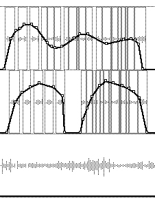
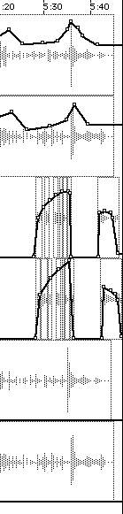
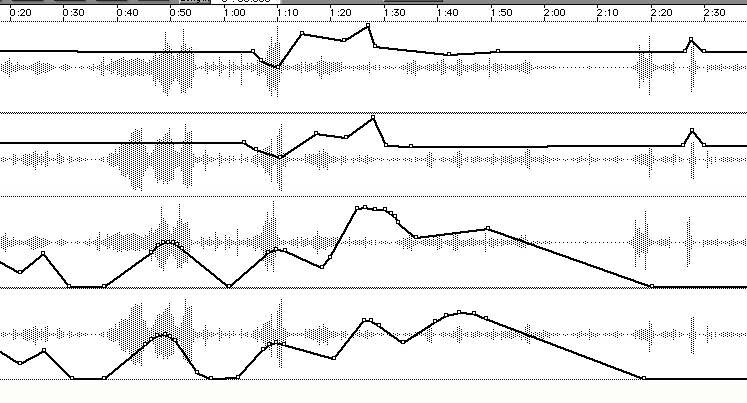

# Ch 31. Digital Editing Systems and Csound

by Dr. Robert L. Cooper

## INTRO

When I first started using Csound I was "perfing" everything on Micro Technology Unlimited's Digi-Sound 16 system in a 386 PC clone with 8MB RAM! The interface was fine but the processing speed was horrendous. It took forever to compile some of the more CPU intensive opcodes and various orchestra configurations. My recourse to this extraodinary amount of compilation time was to compile smaller files and port the result into a sound editor and then utilize a sequencer to control a sampler, where I would load my sounds. Since then I have found a groove that works for me. I still compile sound files (size not being an issue now) with Csound and port the result to Digidesign's Pro-Tools II editing system and do a lot of composing and final work in that environment. It saves compilation time and eliminates the need to re-write orchestra and score files. I also use a number of editing tools that are available on the MAC such as SoundHack, Hyperprism, Sound Designer II, TurboSynth, SoundEffects, the TDM Plug-ins for Pro-Tools, and occassionally, on the PC, Sound Forge or CoolEdit.

## Cymbolic

I have been using a subtractive synthesis approach in the use of sample processing in my compositions with sound manipulation opcodes. I will be illustrating various orchestra and score files that I used in a composition called Cymbolic.

In Cymbolic, I used two suspended cymbals as sound sample sources (one with a clear attack when struck and the other with less of the initial strike apparent and after editing each for optimal clarity, proceeded to subject each to a number of processes. Using the soundin opcode and Gen 1, I processed the resulting samples using a number of the signal modifiers and generators to bend, transpose, reverberate, filter, and create layers.

Example 1 displays a stereo sample (a1,a2 soundin) with one channel being reverberated within the instrument for timbre enhancement and the 2nd channel as a "dry" component. Each channel is subjected to a different panning function and balanced for amplitude normalization.

```csound
; EX. 1

sr=44100
kr=2205
ksmps=20
nchnls=2

; instr 1
k1 linseg 1, p3*.5, 4.7, p3*.5, 2.6                       ; time varying reverb loop time
k2 linseg 0, p3*.5, 1, p3*.5, 0                           ; automated panning
k3 expseg 1, p3*.3, .5, p3*.3, .1, p3*.3, .7, p3*.1, .5   ;automated panning
a1, a2 soundin "cym.snd", p4
a3 reverb a2, k1
a4 balance a3, a1
outs1 (a4*k2)+(a1*k3)
outs2 (a4*(1-k2))+(a1*(1-k3))
endin

; SCORE

i1 	0 	2.64 	0
i1 	1 	2.64 	0
i1 	1.5	2.64 	0
```

The orchestra is quite simple, but when I inserted p-fields in the place of the values I could create a somewhat lengthy score to generate a number of variations of the original and archived each for use when I moved from the Csound environment to the Pro-Tools Editing System. By increasing and decreasing the reverb time value, the overall color would change and produced interesting dynamic qualities, dependent on the amount of reverberation and loop-time values.

For example, when the reverb time value was set to about 3.5 or higher the sound became somewhat transparent and when the reverb time value was smaller the sound became more distinct. I used this contrast to achieve a dynamic envelope with the more transparent reverberated sound being a softer dynamic and a dryer sound being a louder dynamic. This would accomodate the dimension of "foreground", "middleground", "background" and all of the space in between, similar to the panning function, but mapped into the "front to back space" in the concert hall. The manipulation of these values could be single, hardwired values (values assigned to p-fields that remain the same for the duration of the relevent event) or continuous values (values that changed over time - achieved by using expseg, linen, or linseg).

I utilized 2 different opcodes (linseg and expseg) for panning to contrast a linear motion and an exponential motion in the stereo field in addition to dividing the p3 variable (duration) differently with each opcode statement. (ie. the k2 linseg in example 1 shows a simple arch envelope - p3*.5 p3*.5 and the k3 expseg divides the duration thus - p3*.3 p3*.3 p3*.3 p3*1). One of the primary gestures involves panning from a subtle and sometimes non-existent presence to a more apparent application. The panning aspect played an important role in the composition and I applied different panning methods throughout the work to help define each section or transition.

An example of a panning application that moves within the stereo field at a faster rate of activity, is shown in example 2. (Now I realize that you can also use various gen subroutines to create an even more extreme panning application by using a configuration with the opcodes - table, phasor, GEN 5 0r GEN 7!).

```csound
; EX. 2

sr=44100
kr=2205
ksmps=20
nchnls=2

instr 1
k1 expseg .5, p3*.1, 1, p3*.2, .1, p3*.2, .5, p3*.1, 1, p3*.1, .1, p3*.1, 1, p3*.1, .2, p3*.1, .7 ; panning
a1 soundin "buzz.snd", 0
a2 reson a1, 400, 20,1  ; filter the sample
a3 balance a2, a1       ; balance the output
outs1 a3 * k1
outs2 a3 * (1-k1)
endin

; SCORE

i1 	0 	1
i1 	2 	1
```

One of the most useful orchestras, for Cymbolic, is shown in example 3. I used an oscili opcode to oscillate a sample at different speeds (.2 to 1.8) to cycle or read the table containing the sample. I used this orchestra at times with a linseg or expseg opcode to control the frequency in a continuous manner later in the comnposition by inserting values that changed by very small degrees (somewhere between .7 to 1.3). This subtle change in oscillation emulated the colorful timbre variations of an acoustic instrument.

```csound
; EX. 3

sr=44100
kr=2205
ksmps=20
nchnls=1

instr 1
a1 oscili 10000, p4, 1 ; load the sample into a table and oscillate according to the p- field entry
out a1
endin

; SCORE

f1 	0 	131072 	1 	"cym.snd" 	0 	4 	0

i1 	0 	 2 	.5 	; p4 = frequency of oscillation
i1 	.5 	 2 	.7
i1 	.9   2 	.3
i1 	1 	 2 	.9
i1 	1.1  6 	.2435
i1 	1.15 8 	.2477
```

This worked well for what I needed in a certain section of the work, but I also needed to glissando a modified (step) glissando effect for other sections and I used a modified version of one of James Mobberley's Csound orchestras shown in example 4. This orchestra/score combination worked very well for long glissando gestures and discreet, but somewhat random results. It was particularly useful in the beginning moments of Cymbolic (the low, pitch drifting rumbling sounds). The orchestra and score permit you to glissando using the middle value (p5... 12) to represent how many notes per octave and the first number (p4... -12) to indicate how many steps below and p6 in the score to indicate the destination pitch in steps (9 steps above).

```csound
; EX. 4

sr=44100
kr=2205
ksmps=20
nchnls=2

; instr 1
i1=p3
i2=1/p3
i3=exp(log(2)*p4/p6)
i4= exp(log(2)*p5/p6)
if p4 = p5 goto nondiv
goto rest
nondiv: i5=(p4+p5)/2
i6=1/(exp(log(2)*i5/p6))
goto dur
rest: i6=log(i4/i3)/(i4-i3)
dur: p3=i1*i6
p7=p7*1000
a1 expseg i2*i3, p3, i2*i4
a1 phasor a1
if p8 = -1 goto reverse
goto table
reverse: a1 = 1 - a1
table: a2 table a1*(sr*i1), 1
a3=a2*p7
outs1 a3
outs2 a3
endin

; SCORE

f1 	0 	262144 	1 	 "cym.aiff" 0 	4 	0
i1 	0 	5 	    -12  12 	    9 	10 	0
```

Whenever I used an opcode that required an ifn (function table), I used GEN 1 to load the cymbal samples and manipulated the orchestra and score files slightly by changing parameter values when needed. Sometimes I would change the skip time parameter, vary the frequency of oscillation by discrete or continuous values, use the reverse version, and many other processes according to the usefullness of particular opcode functions and parameters.

In another example, I used the rand opcode and the oscil opcode to control frequency and load the cymbal sample into GEN 1 This configuration was the foundation for the reverberated and random cycling of the sample in the middle section of Cymbolic.

The frequency of the sample will glissando in whatever direction you indicate (ascending or descending values) in the expseg opcode arguments. The kcps argument in the randh opcode points to the 4th parameter field in the score and provides a means for control from event to event (note entries).

Amplitude is also controlled from the score in most sections and provided a means of controlling the contour of dynamics throughout the work. Example 5 illustrates one of the main orchestra and score files used with this configuration.

```csound
; EX. 5

sr=44100
kr=2205
ksmps=20
nchnls=1

; instr 1
k2 expseg 1,  p3*.2, .4, p3*.3, .7, p3*.3, .5, p3*.2, 1 ; provide random value for the randh opcode
k1 randh  k2, p4                                        ; random frequency oscillation in stepped values
a1 oscili p5, k1, 1
out a1
endin

; SCORE

f1 	0 	262144 	1 	"cym.aiff" 	0 	4 	0
i1 	0 	10 	1 	10000 	; p4=amplitude
i1 	2 	10 	1 	10000
i1 	5 	10 	1 	10000
```

After each sound had been developed and a multitude of variations compiled and saved, I transferred all samples to Digidesign's Pro-Tools Editing System. With an 8 track digital editing environment I was able to cut, paste, duplicate, and re-arrange all the sounds into a sequence that made musical sense to me. Each track has editable graphs for volume and panning in addition to allowing you to seamlessly fade (with a good number of shapes for the crossfade) from one sound to the next. This enabled me to stretch certain aspects of individual sound. This is most evident at the end of Cymbolic. The final cymbal crash was modified with various filters, combined into a single stereo sound file and the last 2 seconds of the original processed sound copied, displaced and layered to prolong the decay.

It was at this point in the compositional process that I would port certain sounds to SoundDesigner, HyperPrism, or SoundHack for tweaking. I would apply most reverb effects from the Pro-Tools system and bounced everything to 2 track stereo when finished. The Pro-Tools system allows you to edit all samples in a non-destructive manner so that you end up not butchering your original samples by mistake or through system crashes.

The use of the opcode - randh provided the primary function for most of the section of Cymbolic at ....... (minutes/seconds). Many variations were compiled and examined for application in a time continuum that would portray a sense of contrast to the previous musical material. By cutting, pasting and editing the original compiled samples I arrived at what you hear at this point in the work. The next example is a modified version of the original orchestra ( using a higher sample rate).

```csound
; EX. 6

sr=44100
kr=2205
ksmps=20
nchnls=2

; instr 1
k1 linseg  .5,     p3*.1, 1, p3*.7, .1, p3*.1, 1, p3*.1, .5  ; panning function
k2 expseg  4,      p3*.5, 4.3, p3*.3, 4.8, p3*.2, 4.5        ; varies the speed of sample oscillation
k3 randh   1.5,    k2, p4 ; generates a control signal to provide a series of random ;frequency control values
a1 oscil   15000, (k3*1.3)*1.1, 1 ; sample loaded into table and controlled with the oscil opcode
   outs1   a1 * k1     ; panning
   outs2   a1 * (1-k1) ; panning
endin
```

I was unable to generate a consistent reiteration of the sample with this orchestra, but with the help of the Pro-Tools editing sytem I was able to create what I needed by layering and slight displacement of each entry. The illustration below shows a Pro-Tools II interface and the resulting waveforms and volume graphs for the cut and pasted version of part of this section of the work. The first shows a gradation in amplitude and reiteration of a specific region of the original sound which you can see in the longer waveform in the lower most track of the first picture. This is a portion of the "gravity free cymbal oscillating sound".



The next picture shows a layering of a similar sound slightly displaced in time, to create a crescendo.



By layering the same file in multiple tracks, I created a macro dynamic contour in different sections of the work and controlled panning in the same manner. Each track can be assigned different placement in the stereo field (L or R) and a sort of crossfading between adjacent tracks creates a visual control model.



My favorite sound is the sound I describe as "gravity free cymbal oscillating sound" (see first picture above). This, to me, sounds as if the cymbal is self oscillating in a inconsistent fashion. I could have used the loscil or oscil opcodes to generate a consistent oscillation of sound, but I wanted an effect of starting, almost stopping, and continuance of the oscillating sound impression.

The continuous dwell of amplitude and growing spectral envelope of the sample was accomplished using a set of variables for the amplitude and frequency arguments using the orchestra example below.

```csound
; EX. 7

sr=44100
kr=2205
ksmps=20
nchnls=1

; instr 1
k1  expseg  100,   p3*.1, 90,    p3*.2, 100,   p3*.1,95,
p3*.1, 100, p3*.2, 90,    p3*.1, 100,   p3*.1, 95 ,    p3*.1,  100       ; change the frequency of the sample via p3
a1 loscil 20000,   k1,    1,     120,   2,     15000 , 50000 , 2, 10000, 50000 ; loop set to forward and backwards
out a1
endin

; SCORE

f1 	0 	131072 	1 	"cym.aiff" 	0 	4 	0
i1 	0 	20
```

This orchestra and score provided a basic template to generate a number of varied sound files which changed in terms of duration, speed, and pitch. Each sound file was edited and ported into the Pro-Tools system for layering, juxtaoposing and shaping the overall contour to achieve an aural impression of elasticity and a sort of "ostinato", as a structural element for the middle/latter section of the piece.

I added filter opcodes (reson, alpass, and comb) in later orchestras similar to example 7 to increase the spectral density and enhance the dynamic quality of the sound as shown in example 8.

```csound
; EX. 8

sr=44100
kr=2205
ksmps=20
nchnls=1

; instr 1
k1 expseg 100, p3*.1, 90, p3*.2, 100, p3*.1,95,
p3*.1, 100, p3*.2, 90, p3*.1, 100, p3*.1, 95 , p3*.1, 100 ; change the frequency of the sample via p3
k2 expseg 100, p3*.2, 450, p3*.2, 50, p3*.1, 250, p3*.3, 500, p3*.2, 275 ; change the center frequency over time
k3 expseg 50, p3*.1, 30, p3*.2, 50, p3*.1, 75, p3*.3, 25, p3*.2, 15 ; change the bandwith over time
a1 loscil 20000, k1, 1, 120, 2, 15000 , 50000 , 2, 10000,50000 ; loop set to forward and backwards
a2 reson a1, k2, k3, 1 ; filter the result of a1
a3 balance a1, a2 ; scale the result for amplitude
out a3
endin
```

## Conclusion

It would be impossible for me to recreate the work at this point since only small orchestra and score files were used and since most of the final work was accomplished using the editing system. Even showing the editing system pictures is somewhat misleading since I periodically "bounced" everything to disk (saving all tracks as either a mono file or split stereo file) to maintain a manageable file in the Pro-Tools environment. This "back and forth" approach was adhered to during most of this work. I would select a series of opcodes that provided the parameter flexibility to achieve certain sound shapes and would port each resulting sound file into an editing system for minute shaping ( cutting off portions of silence, selecting portions of the sound, processing with various functions inherent in the particular editor, layering, eliminating extraneous noise and clicks, etc...).

Editing in a visual environment provides a fast and efficient means of shaping the macro and micro sonic contours and allows immediate layering of a particular sound or sounds, by way of cutting, pasting and delimiting individual sounds. With a host of powerful editing tools available (free and otherwise), this approach will encourage a more concentrated effort on the compositional process and hopefully, limit the amount of time learning and trying to interpret "code."
