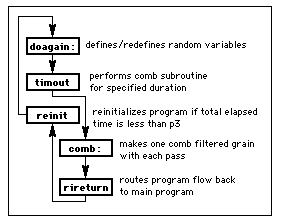

# Ch 40. Composing with Csound: Granular Strategies

by Jon Christopher Nelson

Csound provides a flexible and rich environment for both synthesizing and processing sound. In my recent electro-acoustic compositions, I capitalize on Csound’s unique sound processing capabilities, utilizing a panoply of linear, non-linear, and analysis/resynthesis techniques to generate material from sampled sounds. However, of these techniques, I have been most interested in exploring granular sonic worlds by incorporating quasi-synchronous and asynchronous granular synthesis and soundfile granulation instruments in my compositions.1 This article examines three of my granular instruments and GrainMaker 2.0, my Csound score generator for soundfile granulation.2

My early granular synthesis instrument (see flowchart in Figure 1 and code for instr 1 below) predates the more recent fof and grain opcodes. In its essence, this instrument is a random note generator that creates streams of notes. The instrument uses an oscili to repeatedly cycle through a stored envelope function table. With each pass through this function table, a new note rate and pitch is calculated. If the note stream contains fewer than 25 notes per second, the individual notes are delineated aurally. In contrast, faster note streams reap quasi-synchronous granular synthesis in which the notes are heard as grains in a composite sound. In this instrument, the note or grain duration is inversely proportional to the grain rate: 10 notes per second reaps notes that are 1/10th of a second long, 50 notes per second generates notes that are 1/50th of a second long. More dense granular synthesis is achieved by using multiple copies of this instrument simultaneously. Using multiple copies of this instrument can also help diminish or accentuate amplitude modulation artifacts. This instrument was used to generate quasi-synchronous granular synthesis streams in my 1992 compositions Bauxite Dreams for tape and Waves of Refraction for guitar and tape.

Figure 1 Random Note Generator Flowchart.


```csound
 instr 1 ;random pitch/quasi-synchronous granular synthesis
i1=cpspch(p4) ;starting center pitch
i2=cpspch(p5) ;ending center pitch
k2 line p6,p3,p7 ;dev around center pitch
k3 line p8,p3,p9 ;notes/grains per second
k5 randh 2,k3 ;random element to grain rate
k4 randh k2,k3+k5 ;pitch deviation for each note
;k3+k5=actual attack rate
a5 oscili 1,k3+k5,p12 ;env determined by attack rate
k6 line p10,p3,p11 ;amplitude change
k1 line i1,p3,i2 ;center frequency line
a1 oscili a5*k6,k1+k4,p13 ;actual sound
a1=a1*p14
a2=a1*(1-p14)
outs a1,a2
endin
;;;;;;;;;;;;;;;;;;;;score file sample;;;;;;;;;;;;;;;;;;;
f 3 0 8192 10 1
f 10 0 1024 -19 1 .5 270 .5
;i1 pch.i-f rand.i-f rate.i-f amp.i-f env wave amp
i1 0 20 8.00 10.00 100 7 30 400 3000 3000 10 3 .5
i1 0 20 9.00 9.01 10 7 3 400 3000 3000 10 3 .5
i1 0 20 7.00 8.02 500 7 30 400 3000 3000 10 3 .5
i1 0 20 6.00 7.03 50 7 3 400 3000 3000 10 3 .5
i1 0 20 10.00 6.04 100 7 30 400 3000 3000 10 3 .5
i1 0 20 8.06 11.05 10 7 3 400 3000 3000 10 3 .5
i1 0 20 8.03 10.11 500 7 30 400 3000 3000 10 3 .5
i1 0 20 8.09 5.06 50 7 3 400 3000 3000 10 3 .5
i1 0 20 7.09 10.10 100 7 30 400 3000 3000 10 3 .5
i1 0 20 7.06 10.09 10 7 3 400 3000 3000 10 3 .5
e
;p4-5=center pitch (initial and final)
;p6-7=random pitch deviation range (initial and final)
;p8-9=notes/grains per second (initial and final)
;should be at least 2
;p10-11=note amplitudes (initial and final)
;p12=envelope function table number
;p13=wavetable function table number
;p14=channel 1 amplitude multiplier
```

With the addition of a few lines of code, this instrument can randomly pan each grain or dynamically adjust the random element of the grain rate. Similarly, the audio generating oscili can be replaced by other sound generating opcodes, including gbuzz, foscil, or even soundin and loscil. This provides a simple means of granulating soundfiles by imposing a quasi-synchronous granular stream of envelopes on the sample.

Although I enjoy synthesizing sound using granular techniques, I am even more interested in processing soundfiles with granular techniques. Consequently, I created a granular comb filter instrument to use in my 1996 electro-clip composition entitledA Chris Mann Mambo. This instrument (see flowcharts in figures 2 and 3 as well as the code for instr 2 below) is similar to instr 1 above in that it creates a quasi-synchronous stream of grains. However, each grain generated by this instrument is a randomly tuned comb filter imposed on a monophonic soundfile. Since the comb opcode requires an init value for its loop time argument, this instrument utilizes timout, reinit, and rireturn to generate different loop times for each grain. In this instrument, each comb filter grain is randomly placed in the stereo plane. Using multiple copies of instr 2 can generate a dense granular comb filter bank. This instrument must be used in conjunction with a global output instrument. Instr 3 below provides an example of a global output soundin instrument that provides the required ga1 audio signal to be filtered by instr 2. In this case, instr 3 does not actually generate sound itself.

Figure 2 Basic Program Flow for Random Comb Generator.



Figure 3 Random Comb Generator Flowchart.


```csound
instr 2 ;random stream of comb filter notes/grains
doagain:?
krrate randh p5,p4,-1 ;set rate deviation
krate=p4+krrate ;set rate
ktime=1/krate ;grain duration
krevtime=ktime/5 ;set reverb time
kplace randh .5,krate,-1 ;values -.5 to +.5 for pan placement
kchnl1=kplace+.5 ;chnl 1 amp. mult.
krcps randh p6,krate,-1 ;rand pch deviation
krcps=abs(krcps)+p7 ;pch dev. + base
ioct=i(krcps) ;krate to irate
ilpt=1/cpsoct(ioct) ;calculate looptime
timout 0,i(ktime),comb ;start "comb:" loop
reinit doagain ;back to "doagain:"
;to reset values
comb:
kenv oscil1 i(ktime)/4,1,i(ktime)/2,1 ;envelope function
kenv2 oscil1 0,1,i(ktime),1 ;smoothing env.
a1=ga1*kenv ;ga1 to be filtered
acomb comb a1,krevtime,ilpt,0 ;filter it
acomb=acomb*kenv2 ;smooth it
rireturn ;back to reinit
ablnc balance acomb,a1 ;balance it
ablnc=ablnc*p8 ;amp multiplier p8
afinal1=ablnc*kchnl1 ;chnl 1 amp
afinal2=ablnc*(1-kchnl1) ;chnl 2 amp
outs afinal1,afinal2 ;make the sound
endin
instr 3 ;global out soundin
kenv linseg 0,.1,1,p3-.2,1,.1,0 ;amp env smooths ends
a1 soundin p4,p5
kenv1=kenv*p6
ga1=kenv1*a1
endin
;;;;;;;;;;;;;;;;;;;;score file sample;;;;;;;;;;;;;;;;;;;
f 1 0 513 8 0 150 .5 50 1 113 1 50 .5 150 0
;i3 start dur sndin# skiptime amp
i3 0.425 45 1 0 .2
;i2 start dur rate dev roct octbase amp
i2 0 45 4 2.1 3 7 .25
e
;p4=base notes/grains per second
;p5=random deviation in notes/grains per second
;p6=random pitch range above base (expressed in oct)
;p7=base pitch (expressed in oct)
;p8=amplitude factor
```

Instr 2 assumes that an envelope function is stored in function table 1. With several small modifications, the envelope function table number can also be determined randomly for each grain.4 The global audio signal input can include several soundfiles or soundfile exerpts mixed together with instr 3. In addition, a loscil could easily replace the soundin opcode in instr 3 to allow the transposition of the original soundfile.

While the fof and grain opcodes provide asynchronous granular synthesis generators, they do not provide soundfile granulation capabilities. Soundfiles can only be granulated in Csound by using the granule opcode or by imposing granular envelopes on samples played with soundin, loscil, or table opcodes. Each of these opcodes have limitations that prevent their utilization in my ideal soundfile granulation instrument, which should provide a means for independently transposing and/or time stretching a sound, reading the soundfile with random skip times, imposing random panning and amplitude functions on each grain, and dynamically changing various grain attributes including density and duration. For example, soundin allows a skip time into a soundfile but cannot transpose while loscil transposes but always starts at the first sample. In both soundin and loscil, the progression through the soundfile is linear from the starting point to the end of the file. In contrast, the table opcode, which can be used if the soundfile is read into a function table with a power of two size, allows both transposition and skip time. Although transposition levels and skip times can be calculated on each reinitialization pass of an instrument similar to instr 2 above, this will still only provide a quasi-synchronous stream of grains. Furthermore, a complex instrument based upon this model will generate sound slowly as a result of the numerous grain attribute computations required. As a result, asynchronous soundfile granulation in Csound is best achieved by using a simple instrument that accesses a tabled soundfile to generate a single grain in conjunction with a score generating program that stochastically generates grain data.

GrainMaker 2.0 is a program I developed in MAX that generates Csound soundfile granulation score files. While generating a scorefile, the user can change a number of grain parameters by either moving faders with a mouse or depressing computer keyboard fader automation keys. In this respect, this program provides a means of "drawing" a score file while it is being created. The grain parameters controlled by GrainMaker 2.0 are as follows:

- base grain rate
- grain rate random deviation (added to base)
- base grain duration
- grain duration random deviation (added to base)
- soundfile progression factor (positive, zero, or negative values)
- base sinitial skip time into the soundfile
- skiptime random deviation (around the base)
- base left-right grain location in stereo plane
- left-right grain location random deviation (around the base)
- base grain amplitude
- grain amplitude random deviation (added to base)
- base envelope function table number (from 1-50)
- envelope function table random deviation (added to base)
- base soundfile transposition (expressed in semitones)
- soundfile transposition random deviation (around the base)

In addition to these parameters, GrainMaker 2.0 includes a RandMaster gate that generates clusters of grains with random durations when selected. The minimum and maximum time limits for both the on and off (open and closed) gate durations are adjustable. The following figure shows the GrainMaker 2.0 main control panel.5


Figure 4 GrainMaker 2.0 Main Control Panel.

GrainMaker 2.0 generates a Csound score file that can be used with the GrainMaker2.0.orc file to granulate any soundfile entitled "soundin.1". By using a relatively simple instrument that generates a single grain, Csound efficiently and asynchronously granulates soundfiles. The following flowchart (see figure 5) and instrument code provides the entire GrainMaker2.0.orc:


Figure 5 GrainMaker Orchestra Instrument Flowchart.

```csound
 instr 1 ;granulates soundfile entitled "soundin.1" p4=sfskip
ileft  = p5
iright = 1-p5
iskip  = int(p4*sr) ;calculates first sample #
iamp   = p6*30000
ilast  = int(p3*sr*p8)+iskip ;calculates last sample #

kenv   oscil1i 0,iamp,p3,p7 ;envelope function
aread  line   iskip,p3,ilast ;arate index to the table
asnd   tablei aread,101 ;reads tabled sf (f 101)
afinal = asnd*kenv
outs   afinal*ileft, afinal*iright
endin

;;;;;;;;;;;;;;;;;;;;score file sample;;;;;;;;;;;;;;;;;;;
f6 0 513 8 0 150 0.500000 50 1 113 1 50 0.500000 150 0
f101 0 131072 1 1 0 4 1
;i4 start dur sfskip chnl1amp %amp env T factor
i4 10.442250 0.028000 1.261519 0.430000 0.310000 6 1.0
i4 10.439750 0.032000 1.251819 0.090000 0.410000 6 1.0
i4 10.444249 0.033000 1.251119 0.860000 0.390000 6 1.0
i4 10.447749 0.025000 1.252419 0.990000 0.650000 6 1.0
i4 10.448249 0.033000 1.256719 0.900000 0.510000 6 1.0
i4 10.449748 0.029000 1.256019 0.520000 0.930000 6 1.0
i4 10.456247 0.025000 1.250319 0.420000 0.410000 6 1.0
i4 10.454747 0.025000 1.262619 0.530000 0.940000 6 1.0
i4 10.460247 0.026000 1.249919 0.720000 0.420000 6 1.0
i4 10.459746 0.033000 1.260219 0.030000 0.580000 6 1.0
i4 10.465246 0.030000 1.247519 0.580000 0.610000 6 1.0
i4 10.467746 0.026000 1.252820 0.330000 0.470000 6 1.0
i4 10.471245 0.030000 1.259120 0.880000 0.880000 6 1.0
e
```

My compositions They Wash Their Ambassadors in Citrus and Fennel (1994) for voice and tape and the rain has a slap and a curve (1997) for tape extensively utilize GrainMaker to granulate soundfiles.6 In fact, the sonic foundation of the entire third movement of the rain has a slap and a curve, entitled a whisper of rain, is a granulation of an original 1.572 second sample time-stretched to 210 seconds. This particular asynchronous granulation contains approximately 2000 grains per second with randomly calculated grain amplitudes, envelopes, transpositions (spanning nearly two octaves around the original frequency), durations (between 40-60 milliseconds) and spatial locations in the stereo plane. Similarly, lengthy sections of They Wash Their Ambassadors in Citrus and Fennel contain granulations of sampled material.

The instruments covered in this chapter provide a glimpse not only into my fascination with granular synthesis and soundfile granulation, but also into programming techniques for granular applications. Although asynchronous soundfile granulation presents a particular Csound programming challenge, my GrainMaker score generator provides one possible solution. As is evidenced above, Csound continues to provide a fruitful environment in which to explore a variety of granular techniques.

## References

- DePoli, Giovanni and Aldo Piccialli. 1991. "Pitch-Synchronous Granular Synthesis" in Representations of Musical Signals, G. DePoli, A. Piccialli, and C. Roads, eds. Cambridge Massachusetts: MIT Press.
- MacKay, J. 1984. "On the Perception of Density and Stratification in Granular Sonic Textures: An Exploratory Study." Interface 13: 171-186.
- Roads, Curtis. 1985. "Granular Synthesis of Sound" in Foundations of Computer Music, C. Roads and J. Strawn, eds. Cambridge, Massachusetts: MIT Press.
- Roads, Curtis. 1991. "Asynchronous Granular Synthesis" in Representations of Musical Signals, G. DePoli, A. Piccialli, and C. Roads, eds. Cambridge Massachusetts: MIT Press.
- Roads, Curtis. 1996. The Computer Music Tutorial. Cambridge, Massachusetts: MIT Press.
- Roads, Curtis. 1997. "Granular Synthesis." Keyboard Magazine 23(6), June 1997: 42-52.
- Truax, Barry. 1986. "Real-Time Granular Synthesis with the DMX-1000." Proceedings of the 1986 International Computer Music Conference. San Francisco,: International Computer Music Association, 231-235.
- Truax, Barry. 1988. "Real-time granular synthesis with a digital signal processor." Computer Music Journal 12(2): 14-26.
- Truax, Barry. 1994. "Discovering Inner Complexity: Time Shifting and Transposition with a Real-time Granulation Technique." Computer Music Journal 18(2): 38-48.

## Misc

To randomly select from among 50 envelopes, do the following:

- insert these lines in the doagain section beneath the krate statement

```csound
kenvfn randh 49,krate,-1 ;random number -49 to +49
kenvfn=int(abs(kenvfn)) ;integer-absolute value to get 0-49
```

- replace the existing kenv statement with the following

```csound
kenv oscil1 i(ktime)/4,1,i(ktime)/2,i(kenvfn)+1
``
