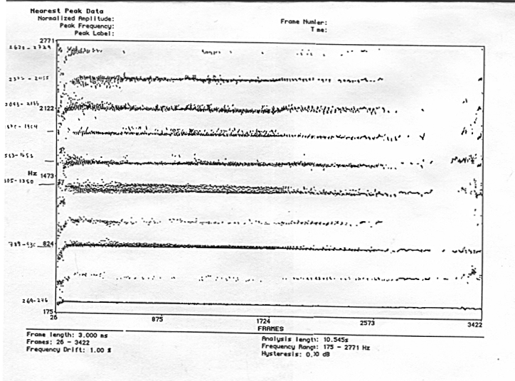
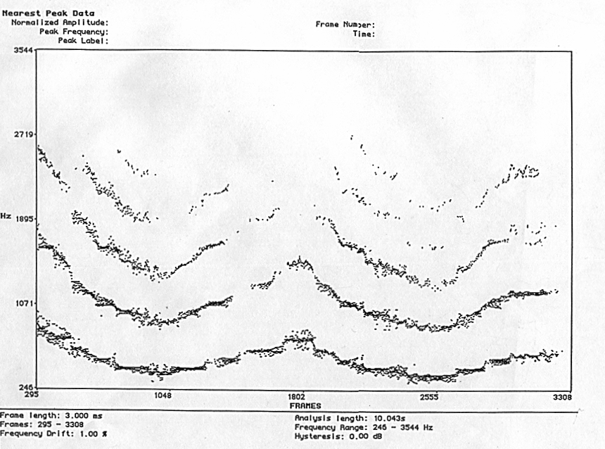
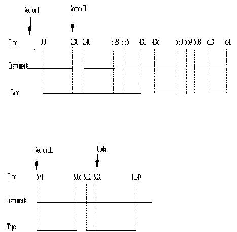

# Ch 42. Extending timbral possibilities for mixed ensembles using extended techniques

by Ileana Perez Velazquez

Since the 60's, computer programs such as Music V and Csound have been used to implement algorithms that simulate acoustic instruments. The resultant spectral content produced by the Csound instrument can be close to that produced by acoustic instruments. The Csound instrument can be designed so that the spectral content of a sound source varies through time. The spectral content can also change in relationship with the fundamental pitch. These reasons have inspired some composers that have used Csound orchestras as extensions of acoustic instruments in compositions for instruments and tape.

The flexibility of the structure of Csound allows the creation of imaginary instruments that could contain features of two or more instruments. We can also design instruments with characteristics of both instrumental and vocal sounds. These possibilities provide a vast range for imagination and creativity.

As composers and performers have pushed acoustic instruments beyond traditional boundaries using extended techniques, Csound can open frontiers in extending these new sound sources. The resultant sounds can be used in combination with acoustic instruments. Instruments that contain some characteristics of the spectra of sounds produced by extended techniques were designed in Csound and used as sound files for the tape of Conversations, a piece for saxophones, bassoon, bass clarinet, and tape I composed in 1995. The analysis of the spectra of sounds produced by extended techniques also inspired the general structure of Conversations. The present chapter will discuss the timbral design, organization, and structure of Conversations.

## Motivations and aesthetic

The composition of Conversations was begun in response to the question "what if instruments were able to communicate as directly as speech?" Much of the composition process of the piece was the working out of this metaphor between the sound of the live instruments and the sound of speech. The need for air by both voice and wind instrumental sounds suggested the idea of mixing resynthesized voice sounds with live and recorded instrumental sounds.

In this piece both instruments and tape communicate in an imaginary language. The tape contains numerous passages where woodwind sounds are applied to the frequency contour of speech. Often, while playing multiphonics, the instrumentalists are asked to sing, speak, and at some climatic points, even scream. This helps give the piece an overall quality of "voiceness."

## Multiphonic spectra of sound sources

Samples of bass clarinet and saxophone multiphonic sounds were analyzed using software called Lemur by Bill Walker and Kelly Fitz. The graphs obtained from the analysis of bass clarinet multiphonics showed formant regions where the energy was concentrated. Figure 1 is one example of the spectrum of bass clarinet multiphonic produced by simultaneously vocalizing into the instrument while playing it.

Figure 1


Figure 2 is an example of the spectrum of an overblown multiphonic which shows formants that make a glissando shape through time.

Figure 2


## Processes: FOF and LPC

Synthese par fonctions d'onde formantiques ( FOF )

FOF is a well known technique for synthesizing the timbre of sung vowels (Xavier Rodet). The lowest five formants are individually controlled to simulate the resonances of the singing voice. Using the FOF opcode of Csound,the fundamental frequency of each vowel sound, the vibrato characteristics, the amplitude, and the frequency of each formant were specified using the values given by Rodet (Dodge and Jerse, 1985). In some cases, the value given to the fundamental frequency of the formants were those frequencies from the formants found in the analysis of multiphonics. In other cases the mixture of the sounds obtained by this process with sound files of recorded multiphonics eliminate some of the characteristic of roughness of certain multiphonics.

FOF technique produced sound files of vowel timbre that created glissandi similar to those found in the analysis of overblown multiphonics. The starting points of the glissandi of the formants come from the frequency of the upper and lower borders of the formants of the analyzed multiphonics. Example 1 shows the implementation of this idea in a csound instrument.

Example 1.1: Implementation in a Csound instrument

```csound
instr 1

;p4 Fund freq to which formants of both voices go when descend by glissandi
;-
;p15 Fundfreq form1 (FIRST VOICE, FUND FREQUENCIES FROM MULTIPHONIC SPECTRA)
;p16 Fundfreq form2
;p17 Fundfreq form3
;p18 fundfreq form4
;p19 fundfreq form5
;
;p20 Fundfreq form1 (SECOND VOICE, FUND FREQUENCIES FROM MULTIPHONIC SPECTRA)
;p21 Fundfreq form2
;p22 Fundfreq form3
;p23 Fundfreq form4
;p24 Fundfreq form5
;
ifreqfrm1=p5 ;formants freq)
ifreqfrm2=p6 ;(for first and second voice)
ifreqfrm3=p7
ifreqfrm4=p8
ifreqfrm5=p9
;
iamplfrm1=p10 ;(amplitude of formants)
iamplfrm2=p11 ;(applied to both voices)
iamplfrm3=p12
iamplfrm4=p13
iamplfrm5=p14
;
kgliss1 linseg p15, p3/2, p4, p3/3, p15, p3/3, p15 ;(kgliss for fund freq of first ;voice)
kgliss2 linseg p16, p3/3, p4, p3/3, p16, p3/3, p16
kgliss3 linseg p17, p3/3, p4, p3/3, p17, p3/3, p17
kgliss4 linseg p18, p3/3, p4, p3/4, p18, p3/3, p18
kgliss5 linseg p19, p3/3, p4, p3/4, p19, p3/3, p19
kgliss1 linseg p15, p3/2, p4, p3/3, p15, p3/3, p15 ;(kgliss for fund freq of first ;voice)
kgliss2 linseg p16, p3/3, p4, p3/3, p16, p3/3, p16
kgliss3 linseg p17, p3/3, p4, p3/3, p17, p3/3, p17
kgliss4 linseg p18, p3/3, p4, p3/4, p18, p3/3, p18
kgliss5 linseg p19, p3/3, p4, p3/4, p19, p3/3, p19
;-
kgliss6 linseg p20, p3, p4 ;(kgliss of fund freq of second voice)
kgliss7 linseg p21, p3, p4
kgliss8 linseg p22, p3, p4
kgliss9 linseg p23, p3, p4
kgliss10 linseg p24, p3, p4
;
kamp linseg 0, .15*p3, .05, .58*p3, .1, .27*p3, 0
kamp2 linseg 0, .15*p3, .05, .58*p3, .1, .27*p3, 0
;
krand randh (p4*.1), .5
kvrate1 linseg .1, p3*.001, (p10*.3), p3*.06, (p10*.01), p3*.3, 0;vibrato rate for both ;voices
kvrate2 linseg .1, p3*.001, (p11*.3), p3*.06, (p11*.01), p3*.3, 0
kvrate3 linseg .1, p3*.001, (p12*.3), p3*.06, (p12*.01), p3*.3, 0
kvrate4 linseg .1, p3*.001, (p13*.3), p3*.06, (p13*.01), p3*.3, 0
kvrate5 linseg .1, p3*.001, (p14*.3), p3*.06, (p14*.01), p3*.3, 0
;-
avibdep1 oscil kvrate1, (p4/50)+krand, 1 ;vibrato depth for both voices
avibdep2 oscil kvrate2, (p4/50)+krand, 1
avibdep3 oscil kvrate3, (p4/50)+krand, 1
avibdep4 oscil kvrate4, (p4/50)+krand, 1
avibdep5 oscil kvrate5, (p4/50)+krand, 1
;-
igranulrise=.003 ;rise time excitation envelope
idur=.02 ;duration of grain
igranuldec=.007 ;decay time excitation envelope
iolaps=500;grain overlaps
;
kband linseg 0, p3/2, 6, p3/2, 0 ;formant bandwith
;-
;FIRST VOICE
asig1 fof kamp*ampdb(iamplfrm1), kgliss1+avibdep1, ifreqfrm1, 0, kband, igranulrise, idur, igranuldec, iolaps, 1, 1, p3
asig2 fof kamp*ampdb(iamplfrm2), kgliss2+avibdep2, ifreqfrm2, 0, kband, igranulrise, idur, igranuldec, iolaps, 1, 1, p3
asig3 fof kamp*ampdb(iamplfrm3), kgliss3+avibdep3, ifreqfrm3, 0, kband, igranulrise, idur, igranuldec, iolaps, 1, 1, p3
asig4 fof kamp2*ampdb(iamplfrm4), kgliss4+avibdep4, ifreqfrm4, 0, kband, igranulrise, idur, igranuldec, iolaps, 1, 1, p3
asig5 fof kamp2*ampdb(iamplfrm5), kgliss5+avibdep5, ifreqfrm5, 0, kband, igranulrise, idur, igranuldec, iolaps, 1, 1, p3
;-
;SECOND VOICE
asig6 fof kamp*ampdb(iamplfrm1), kgliss6+avibdep1, ifreqfrm1, 0, kband, igranulrise, idur, igranuldec, iolaps, 1, 1, p3
asig7 fof kamp*ampdb(iamplfrm2), kgliss7+avibdep2, ifreqfrm2, 0, kband, igranulrise, idur, igranuldec, iolaps, 1, 1, p3
asig8 fof kamp*ampdb(iamplfrm3), kgliss8+avibdep3, ifreqfrm3, 0, kband, igranulrise, idur, igranuldec, iolaps, 1, 1, p3
asig9 fof kamp2*ampdb(iamplfrm4), kgliss9+avibdep4, ifreqfrm4, 0, kband, igranulrise, idur, igranuldec, iolaps, 1, 1, p3
asig10 fof kamp2*ampdb(iamplfrm5), kgliss10+avibdep5, ifreqfrm5, 0, kband, igranulrise, idur, igranuldec, iolaps, 1, 1, p3
;-
asig11=(asig1+asig2+asig3+asig4+asig5+asig6+asig7+asig8+asig9+asig10)*2300
outs asig11, asig11
endin

; Example 1.2: Score file for Example 1.1

f1 0 1024 9 1 1 0
f2 0 256 7 0 128 1 0 -1 128 0
;
;formant freq and amp for a male vowel. The high point of the glissandi are freq. from ;a multiphonic spectra
i1 0 14 440 650 1100 2860 3300 4500 0 -8 -13 -12 -19 426 1305 1380 1583 1653 1870 1904 2093 2184 2372 2435
;-
;p4=fund freq of lower formant
i1 7 7 789 609 1000 2450 2700 3240 0 -6 -12 -25 -34 789 1305 1380 1583 1653 1870 1904 2093 2184 2372 2435
;-
;formant freq and amp for a male vowel. The high point of the glissandi are the freq. ;from multiphonic spectra
i1 14 7 110 609 1000 2450 2700 3240 0 -6 -12 -25 -34 426 1305 1380 1583 1653 1870 1904 2093 2184 2372 2435
;p4=the fund freq of the higuer formant
i1 16 7 2524 609 1000 2450 2700 3240 0 -6 -12 -25 -34 426 1305 1380 1583 1653 1870 1904 2093 2184 2372 2435
```

## Linear Predictive Coding (LPC)

LPC is a technique for the analysis and resynthesis of the speech waveform. It is "a procedure for efficient encoding of the speech wave by representing it in terms of time-varying parameters related to the transfer function of the vocal tract and the characteristics of the excitation." (Atal and Hanauer, 19..) The analysis used the Winham and Steilitz algorithms programmed for the Unix environment by Lansky whereas the resynthesis was implemented using Csound language. "In the resynthesis of the voice, the excitation source (periodic pulse for vowels or noise for consonants) is fed through the all-pole filter to reconstitute the waveform of the speech." (Dodge, Jerse, 1985) The coefficients of the all-pole filter for the resynthesis were determined by the analysis program.

Since LPC separates resonance (filter coefficients) from excitation source, it is common on resynthesis to change the speed of the speech without altering its timbre or fundamental frequency.

Csound provides two types of unit generators to manipulate LPC analysis files: lpread, which reads in an analysis file at the k-rate and lpreson and lpfreson, which implement the recursive filter specified by the analysis file.

In Conversations, the Csound LPC instrument was utilized to slow down the speed of speech. A whisper-like sound was produced via a random generator instead of a pulse generator. The random generator was applied to the vowel part of the algorhythm in order to change the timbre of the speech. This was accomplished by simply changing the value that controls the threshold between voiced and unvoiced segments of the resynthesized speech. In Csound the threshold is controlled by kerr, which is used to determine the voice/unvoiced nature of the excitation..

```csound
Example 3: Csound instrument used to produce LPC sounds in Conversations

sr = 44100
kr = 441
ksmps = 100
nchnls = 2
;
instr 1
;p3 duration over which resynthesis will occur
;p4 lpc analysis time where resynthesis should begin
;p5 lpc analysis time where resynthesis should end
;p6 transpose
;p7 function table of GBUZZ
;p8 control the output
;p9 file lpc input
;p10 kerr value get from the lpc analysis file. Controls ;the threshold between voiced (vowels) and unvoiced ;(consonants) segments
;p11 control of gbuzz kr (specifies multiplier in the series ;of amp coefficients, 1 ;is its standard value)
;
ktime line p4, p3, p5
krmsr,krmso,kerr,kcps lpread ktime, p9, 32, 176.4
;lpread read the analysis file
;at ktime rate
;krmsr: root mean square value of the ;residual of analysis. (Can be used as ;an amplitude parameter)
;krmso: rms of the original. Could also be ;used as an amplitude parameter
;kerr: the normalized error. Determine ;voice/unvoiced nature of excitation
;kcps: pitch in cps
;32 (numbers of poles)
;176.4 (framerate/sec)
;-
if kerr > p10 kgoto voic ;kerr value- threshold voice/unvoiced
;-
Example 4. Implementation of crossynthesis using the LPC instrument of example 3.
instr 1
ktime line p4, p3, p5
krmsr,krmso,kerr,kcps lpread ktime, p9 , 32, 176.4
;-
if kerr > p10 kgoto voic;kerr value
;-
asig soundin 1 ;soundin for saxophone sound ;replacing the generator of vowels
;-
kgoto filt
;-
voic: asig rand krmsr ;random generator of noise for ;consonants
;-
filt: aout lpreson asig ;voiced and unvoiced signals ;go through this filter
;
aout gain aout, krmso
aenv linseg 0,.01,1,p3-.02,1,.01,0,1,0
;
out (aout*aenv)*p8
endin
```

Multiphonic sounds were analyzed and resynthesized using LPC techniques. As the system was not designed to work with multiphonics, the result of the resynthesis was a high pitched sound with a "raspiness" similar to the timbre of the glottis. This timbre is heard at the end of the second and third sections of the tape.

## Structure

Conversations is divided into three sections with a coda. The first section starts with instruments playing, the second section starts with the tape while both instruments and tape start together in the third section. The graph in figure 3 shows the overall structure of Conversations, illustrating the relationship between the live instruments and the tape.

Figure 3


The structure of the piece was partially inspired by the spectrum of analyzed multiphonics. The analysis of some multiphonics show formants widely distributed during the attack portion of the sound. Later, the formants become more clearly defined until an identifiable pitch is reached. Afterwhich the frequency bands expand until they start to impinge on one another. This spectrum serves as a metaphor for the changing relationship between the instrumental group and the tape throughout Conversations.

Various processes were applied to the sound sources of the tape by sections. In the first and third sections FOF is the most prominent process, while in the second section sounds produced by LPC predominate. Nevertheless, possibly due to their common "voiceness," there remains a timbral unity to the tape, which is at times shown by the live instruments.

In the first section, the tape and the instrumental group were treated as two separate entities, that begin to gradually overlap. In the second section, the core of the piece, the two groups are clearly differentiated in a relationship characteristic of the concerto grosso: the tape part is treated as soli and the instruments as the ripieno. This is where the metaphor of "voiceness" is most clearly audible. A type of "talking" cross-synthesis was used in section two using the processes explained above.

The timbral organization of the tape part in the second section progresses from cross-synthesised to perceptible speech sounds processed by LPC. From there on the tape achieves a climax while returning to cross-synthesised timbres. Following the climax, the tape features processed multiphonics. The continuity between the first and second sections is achieved through the use of live multiphonics.

During the third section, the overlapping between instruments and tape is more general again. Here the distinction between tape sounds and instrumental sounds is blurred. At the end of this section, the voiced multiphonic sounds of the instrumental part are related in timbre to the LPC cross-synthesis techniques used in the previous section. This is due to using the same words inside the live instruments that were processed in the second section by LPC techniques. During the coda the independence of both tape and instrumental group is restored.

## Conclusion

Conversations was an exiting exploration in musical sounds made possible by programs such as Csound and Lemur. The possibility of using the opcodes FOF and LPC suggested speech like-sounds that combined with those produced by extended techniques suggested the general structure of the piece and the relationship between the tape and performers. In retrospect, however, I wonder how much more I could have done if the analysis and resynthesis were possible in real time. This is a development that I am looking forward to.

## References

1.Charles Dodge and Thomas A. Jerse, Computer Music, 1985
1. B. S. Atal and Suzanne L. Hanauer, Speech Analysis and Synthesis by Linear Prediction of the Speech Wave, 1971
