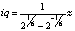
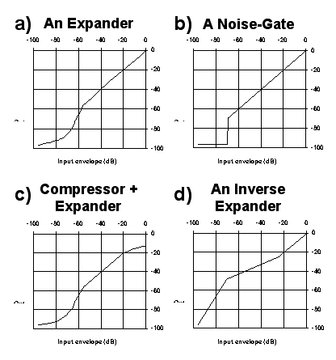

# The Design of Equalizers and Compressors for Studio Use

by Erez Webman

Only ten years ago, high-quality music recording and production took place exclusively in big and expansive studios. The equipment used in these studios was usually analog, and the recording was made using a mechanical multitrack tape machine. Since then, this field has undergone a major revolution. The dramatic developments in digital technology gave rise to the appearance of moderately priced hard-disk recording systems. Nowadays, high-quality music production can take place in small studios and even at home. Throughout the recording and mixing stages, various types of signal processing are applied on the audio tracks, changing their sound characteristics either in a subtle or a drastic way. Several examples for such processors are: reverb, noise reduction, filters (equalizers), and dynamic-range processors such as the compressor. Signal processing is frequently used in order to improve the way the recorded signal sounds and to suit its sonic relationships with the other audio tracks in the context of a mix. In a hard-disk recording environment, Csound can be used as an accurate and highly personalized signal processing tool. In this chapter, the design and development of graphic equalizers and dynamics processors are discussed. These processors are amongst the most important units in a typical recording studio.

## Filter-Banks and Graphic EQ

### Introduction

Generally speaking, Filters can be used to shape sound by attenuating or amplifying some of its frequencies. The use of filters in the recording studio is common, and is usually called Equalization (EQ). Equalization is used in the studio for both technical (corrective) and creative applications. The filtering opcodes provided by Csound are basic filters, such as the two-pole Butterworth implementation (butterlp, butterhp, butterbp and butterbr). These opcodes allow us to perform drastic spectral attentions. For example, aout butterlp ain,2000 cuts the frequencies above 2KHz with a 12dB-per-octave slope. In the studio, a more delicate tone sculpturing is often required. Typically, one might want to attenuate 2 dB here and amplify by 3 dB there. Such a flexibility can be obtained by using the Graphic Equalizer, which is based on a specific BPF network configuration known as the Filter-Bank. The main goal of this section is the review of the design and development of a graphic EQ in Csound.

### Frequency Response Curves and Filter-Networks

During the development or use of a filter-based signal processor, it is often useful to retrieve the frequency-response curve of the filter, or filter-network in use. A very informative curve can be obtained by scaling the amplitude (Y axis) in dB. It is quite simple to generate such a curve with Csound, by using a sweep signal as the source sound (a sweep signal is a sinus signal with a constant amplitude and a continuously increasing frequency that scans the whole hearing range.) The sweep signal is passed through the analyzed filter (or filter-network) and the filter’s output is saved to a sound file. Then, browsing the output sound file with a commercial wave viewer will reveal the amount of attenuation or amplification applied for each frequency. first provides a Csound code for frequency response curve extraction, followed by an example curve for a LPF with a cut-off point set at 6kHz. Note that the output of this program should be considered as a "pseudo" sound file - it should be viewed only, since its audio information is meaningless.

```csound
;============== FREQUENCY RESPONSE CURVE: ORC FILE ===================

sr = 44100
kr = 44100
ksmps = 1
nchnls = 1

instr 1
;---------------------------------------------------------------------
ksweep line 0, p3, 22000 ;Linear line from 0 to 22Khz.
ain oscil 32000, ksweep, 1 ;Generate a sweep signal.
;---------------------------------------------------------------------
aflt butterlp ain, 6000 ;Pass Sweep through the analyzed
; filter (or filter-network.)
;---------------------------------------------------------------------
kflt downsamp aflt ;Transform amplitude to dB:
kout = (kflt>1 ? dbamp(abs(kflt)+0.001) : 0)
aout = kout*300 ;Make the results visible.
;---------------------------------------------------------------------
out aout
endin

;============================= SCO FILE ==============================
f1 0 4096 10 1 ;Sinus ftable used to generate the sweep signal.
i1 0 22 ;Means that each second represents a 1Khz band.
e
;=====================================================================
```


Figure 1: A Csound code that extract the frequency response curve of a filter, or a filter-network. The graph shown is the frequency response curve of butterlp set with a cut-off frequency of 6KHz.

In many cases, it is quite useful to apply a configuration of several filters to shape the sound’s tone. There is obviously a major difference between parallel and serial connection of filters. second demonstrates some proper and improper filter configurations.


Figure 2: (a,b) Connecting four identical BPFs in series gives much more isolated results than using a single BPF. (c) Serially connected HPF and BPF cuts both the high and low frequencies. (d) Connecting a HPF and a LPF in parallel is usually an improper configuration. (e) Serially connecting two different-band BPFs is probably a bad idea: for obvious reasons, the whole sound is drastically attenuated. (f) Two different-band BPFs should be connected in parallel to give the desired "twin-peaks" effect.

#### Filter-Banks

A Filter-Bank is a parallel filter-network configuration consists of band-pass filters which cover the whole hearing range, such as depicted in third. The filter-bank divides the original input sound into several audio signals, each containing a different frequency range of the sound. A summation of all the filter-bank outputs will reconstructs the original sound. When using a filter-bank, each frequency band can be separately manipulated. Various signal processes are based on filter-banks. In our case, flexible filtering can be achieved by separately attenuating or amplifying each of the bands, and then reconstructing the sound by summing up all the modified bands. This process is called Graphic Equalization (EQ) and is demonstrated in third.


Figure 3: A schematic flow of a filter-bank and a graphic equalizer. A filter-bank is a parallel BPF network. Each filter covers a different frequency range, while all the filters cover the whole hearing spectrum. For musical applications, the distribution of the filter frequencies and width is logarithmic. In the above example, the distribution is of one octave.

Before getting deeper into graphic equalization, the filter-bank properties should be discussed. The following elements characterize a filter-bank:

- Number of Frequency Bands: Generally, the more frequency bands are, the narrower these bands will be. In some situations a large number of bands is desired, while in others, a relatively small number will do better.
- BPF Spacing and Width: For musical applications, the natural distribution of the BPF frequencies and width is logarithmic, and is usually measured in octave units third is an example of a one-octave filter-bank.)
- Integrity of the Re-constructed Sound: When the outputs of a filter-bank are summed without any further processing, a successive decomposition and reconstruction of the original input sound takes place. The degree of similarity between the input and the output sounds is a good indication for the quality of the filter-bank. This rule is especially relevant for graphic EQ design.
- Overlapping Between Frequency Bands: The amount and nature of frequency overlapping between each two adjacent BPFs are important characteristics of a filter-bank. In some situations, obtaining less overlapping or even an ideal total isolation is desired, while for other applications, overlapping is preferred. Practically, a minimal overlapping is unavoidable. In addition, trying to minimize the overlapping might degrade the integrity of the re-constructed sound.

## A Graphic Equalizer Implementation

```csound
;============== 1/3 OCTAVE GRAPHIC EQUALIZER: ORC FILE ===============
sr = 44100
kr = 4410
ksmps = 10
nchnls = 1

;-------------------------------1. INSTRUMENT #1: SOUND-FILE READER--
instr 1
gasig soundin "f:\kaza\egtr.wav" ;Read globally for all modules.
endin

;-------------------------------2. A SINGLE-BAND EQ MODULE-----------
instr 2
iq = 4.318
ifrq = p4 ;Center freq. of current band.
iamp = ampdb(p5) ;Amplification of current band.
icmpamp = ampdb(-10) ;Global amplification.
asig = gasig ;Get sound from global reader.
asig butterbp asig,ifrq,ifrq/iq ;Apply BPF on the sound.
out asig*iamp*icmpamp ;Send to output with proper amplification.
endin

============================ SCO FILE ================================
;-------------------------------1. INVOKE GLOBAL SOUND-FILE READER ---
i1 0 5
;-------------------------------2. INVOKE SINGLE-BAND EQ MODULES -----
;-------dur-freq--amp(db)
i2 0 5 32 0 ;------ SOME NOTES ABOUT PROGRAMMING STYLE -----
i2 . . 40 0 ; This Csound program is written in a "parallel"
i2 . . 50 0 ; style. Each instance of instr 2 is responsible
i2 . . 63 0 ; for a single band. The results of all the
i2 . . 80 0 ; instances are sent to the output (and summed
i2 . . 101 0 ; by Csound.) Due to performance considerations
i2 . . 127 0 ; the input sound is read only once (instr 1.)i2 . . 160 0 ;
i2 . . 201 0 ; This program can also be written in a "serial"
i2 . . 253 0 ; manner. Such a code looks like:
i2 . . 320 0 ; ..............................................
i2 . . 403 0 ; instr 1
i2 . . 508 0 ; asig soundin "f:\kaza\egtr.wav"
i2 . . 640 0 ; aband1 butterbp asig, 32, 32/iq
i2 . . 806 0 ; aband2 butterbp asig, 40, 40/iq
i2 . . 1016 0 ; aband3 butterbp asig, 50, 50/iq
i2 . . 1280 0 ; ...
i2 . . 1613 0 ; and so on
i2 . . 2032 0 ; ..............................................
i2 . . 2560 0 ;
i2 . . 3225 +20 ; For the graphic EQ program, and in many other
i2 . . 4064 0 ; cases, the parallel approach results in a more
i2 . . 5120 0 ; modular and compact code.
i2 . . 6451 0 ;
i2 . . 8127 0 ;
i2 . . 10240 0 ;
i2 . . 12902 0 ;
i2 . . 16255 0 ;
i2 . . 20480 0 ;
;=====================================================================
```


Figure 4: A Csound implementation of a Graphic Equalizer.

fourth presents a Csound implementation of a 1/3 octave graphic EQ (Some notes regarding the programming style used can be found in the body of the score file.) The amount of band attenuation or amplification should be specified in the score file, as demonstrated. For convenience, these settings are specified in dB, so a value of 0 means no change, a positive value specifies an amplification, and a negative value indicates attenuation. In a 1/3 octave filter-bank the frequency ratio between every two adjacent BPFs is 21/3 (approximately 1.26). The width of each BPF is assigned by the expression ifrq/iq where ifrq is the center-frequency of the filter, and iq is a constant identical to all the BPFs. The larger iq is, the narrower the filters will be. On one hand, if iq is too high, the frequency response of the filter-bank will contain "drops" where frequencies are not covered by any BPF. On the other hand, if iq is relatively low, overlapping among adjacent BPFs will be introduced (which is not always a bad idea, as discussed before). The "natural" iq for a filter-bank with a distribution of x octaves can be calculated according to the following formula:


In our case, x=1/3, so: 4.318.



For one-octave spacing, the formula returns 1.414, and for half-octave: 2.871. The frequency response ("integrity") of the filter-bank implemented above is shown in fiftha. Globally, the curve is flat. However, along the spectrum, several local drops of up to 2dB are introduced. This phenomenon is unavoidable, given this iq value, and is caused by the shape and phase response of the Butterworth band-pass filter. Hence, any signal passing through the graphic EQ will be slightly colored, even when no amplification or attenuation were specified. In practice, this type of coloration is very subtle and it is usually quite unnoticeable. This filter-bank does introduce some overlapping among adjacent BPFs. Therefore, when specifying a drastic attenuation of a specific band, some of the frequencies designated for attenuation would still pass through the adjacent BPFs. For a more effective attenuation of a specific band, its neighbor bands should be attenuated as well. Anyway, as demonstrated in fifthe, this maximum attenuation of a band is bounded, thus the actual attenuation is lesser than the values specified in the score file. Amplification is less problematic, as can be seen in fifthc. The icmpamp parameter should be used to amplify or attenuate the overall output signal. This parameter could be used to compensate for signal loss or to avoid clipping. For the EQ suggested in fourth, a value of -10dB is a good starting point.

A setting with a lower iq value, such as 2.2, introduces a larger overlapping, resulting in a smoother frequency response (i.e. no -2dB drops, as shown in fifthb.) However, a higher degree of overlapping causes the actual maximal attenuation to be even more limited (fifthf.) The lower value of iq yields wider bands, which are not necessarily a bad idea - it just has a different color.


Figure 5: Some typical frequency response of the 1/3 octave graphic EQ and the modified overlapping graphic EQ (the one with iq=2.2.)

It is possible to drastically reduce the overlapping among adjacent bands, by making the following modifications to the Csound code shown in fourth: In the ORC file, replace the statement asig butterbp asig,ifrq,ifrq/iq with:

```csound
asig butterbp asig,ifrq,ifrq/iq
asig butterbp asig,ifrq,ifrq/iq
asig butterbp asig,ifrq,ifrq/iq
asig butterbp asig,ifrq,ifrq/iq
```

So each filter-bank band will be filtered by four serially connected BPFs (to review the impact of this change, refer to secondb.) In addition, change the iq value to 2.85. Then, edit the score file and change the line i2 . . 20480 to i2 . . 18000. The modified filter-bank yields much narrower frequency bands and a significantly reduced amount of overlapping. In such a configuration, the formula for iq derivation does not hold. The new iq value was set through trial and error, thus optimizing the overall frequency response of the new filter-bank. sixth demonstrates some typical response of this graphic EQ.


Figure 6: A typical frequency response of the narrow 1/3 octave graphic EQ. This EQ is implemented by applying four BPFs in series for each frequency band. (a) The filter-bank’s frequency response is flat, more or less. The roll-off at 19KHz is unavoidable, but shouldn’t be a real problem in most of the cases. (b) This EQ is capable of very deep and narrow attenuation. (c) Amplification is pretty narrow. However, in extreme settings, some artifacts are introduced. (d) The artifacts of example (c) can be easily minimized by adding some amplification to the adjacent bands.

## Compressors and their Applications

Dynamics processors manipulate the dynamic range properties of audio signals. In other words, these processes alter the relationships of the loud parts to the soft ones. This family of processors includes compressors, limiters, expanders, noise-gates and some more special algorithms. Altering the dynamics of a sound can substantially change the way it is perceived by the brain, and can improve the way a specific track sounds in a context of a mix. Compressors are probably one of the most useful signal processing units in the recording studio. Generally speaking, a compressor reduces the dynamic range of a signal, by attenuating the amplitude of the its loud parts. When used properly, compression can make an acceptable recording sounds as a great one.

Generally speaking, a compressor gets an input audio signal, and returns a compressed signal as an output. There main predetermined parameters which are used to control the compressor’s behavior are summarized in seventh. eighth demonstrates the compressor effect.

- Threshold dB : Whenever the input amplitude exceeds the threshold, gain-reduction is applied.
- Ratio : Controls the amount of gain reduction to be applied. Ratio of 1 means no compression. Ratio of 3 means that for each 3dB increase in the input amplitude, the output amplitude is increased in only 1dB.
- Attack Time : The compressor’s reaction-time to an increase in the input signal’s amplitude.
- Release Time : The compressor’s reaction-time to a decrease in the input signal’s amplitude.
- Compensation : Amount of amplification applied on the signal after it was compressed.


Figure 7: The compressor’s main predetermined parameters.

A slow attack time (typically 50-300 msec.) keeps the original transients unaffected, while a faster attack (e.g. 1 msec.) squeezes the whole envelope. Typical release time values range from 30 msec to 3 seconds. Tips on using the compressor are beyond the scope of this book. Throughout the rest of this chapter, the design of a Csound compressor will be described.


Figure 8: The effect of compression on the sound’s envelope.

### Designing a Compressor - The First Step

Generally speaking, a compressor algorithm consists of two main elements: the Envelope Detector and the Gain-Reduction Unit (ninth.) The envelope detector generates the envelope of the input signal, and the gain-reduction unit applies the actual compression on the signal. Usually, the envelope detector takes care of the attack and release parameters (for example, if the specified attack time is slow, the generated envelope should respond slowly to an increase in the input signal’s amplitude.) The gain-reduction unit calculates the gain reduction to be applied according to the generated envelope, the threshold and the ratio settings.


Figure 9: The schematic structure of a compressor.

tenth presents a simple Csound compressor program. The program gets an input sound file and compresses it according to the parameters specified in the score file - threshold, ratio, attack, release and compensation. Part 3 of the program contains a simple envelope follower code, and part 4 consists of the gain reduction unit code.

```csound
;==================== SIMPLE COMPRESSOR: ORC FILE ====================
sr = 44100
kr = 44100
ksmps = 1 ;a setting of kspmps=1 is crucial!
nchnls = 1

instr 1
;-------------------------------1. ENTRY PARAMETERS -----------------
ithresh = p4 ;threshold - in dB (-96 to 0)
iratio = 1/p5 ;ratio - a number >= 1
iattack = p6 ;attack time - in seconds
irelease = p7 ;release time - in seconds
ireamp = ampdb(p8) ;compensation - in dB, usually >= 0
;-------------------------------2. INPUT SOUND -----------------------
ain soundin "f:\kaza\violin.wav"
;-------------------------------3. ENVELOPE FOLLOWER -----------------
ita = 1/(iattack*44100)
itr = 1/(irelease*44100)
kenv init 0
kin downsamp ain ;transform to K-type signals.
kin = abs(kin) ;use absolute value of input signal.
kenv = (kin > kenv ? (kenv*(1-ita)+kin*ita) : kenv*(1-itr))
;-------------------------------4. GAIN REDUCTION UNIT ---------------
ihedroom = dbamp(32768) ;value for 16 bit sounds
kenvd = dbamp(kenv+0.0001)-ihedroom ;translate env. to dB
kreduce = (kenvd >= ithresh ? (kenvd-ithresh)*(iratio-1) : 0)
areduce interp kreduce
aout = ain*ampdb(areduce)*ireamp ;perform compression
out aout
endin

;============================= SCORE FILE ============================
;-----Dur.--Thr.--Ratio--Attack--Release--Compensate
i1 0 4 -20 4 0.001 0.1 0
e
;=====================================================================

```

Figure 10: A Csound compressor code, based on a simple envelope follower algorithm.

The envelope follower updates kenv which holds the temporary envelope value. kenv values are in the range 0..32768. The gain reduction unit translate kenv to dB scale (stored in kenvd). The heart of the gain-reduction unit is the statement kreduce = (kenvd>=ithresh ? (kenvd-ithresh)*(iratio-1). kreduce holds the amount of gain-reduction (in dB) to be applied on the input signal. If kenvd is lesser than the specified threshold, no gain-reduction is performed (i.e. kreduce=0.)

The suggested envelope follower is a simple and fast method to estimate the input signal envelope, according to the given attack and release values. However, it has some annoying weaknesses. To investigate this method, the following experiment was performed: Consider the audio signals aina (signal A: a 200Hz sinus waveform) and ainb (signal B: a richer waveform) synthesized by the code appears in eleventh. The positive part of their waveform is shown in figures twelftha,b.

```csound
kinamp linseg 0,0.2,0,0.0001,1,0.5,0.5,0.5,1,0.5,0,3,0
aina oscil 30000*kinamp,200,1
apart1 oscil 1, 258, 1 ;we assume that table 1
apart2 oscil 1, 520, 1 ; is a sinus wave.
apart3 oscil 2, 1400, 1
apart4 oscil 3, 2300, 1
ainb = (apart1+apart2+apart3+apart4)*4400*kinamp
```


Figure 11: The two audio signals used to test the envelope follower.


Figure 12: (a,e) The positive part of the two test signals aina and ainb. (b,c,d,f,g,h) The envelopes of aina and ainb generated by the simple envelope follower (under various attack time values)

A good envelope follower should return similar envelopes for both of the tested signals. The envelopes generated by the suggested envelope follower, with various attack settings are described in twelfth. The results of this experiment reveals two undesired effects: First, for a given attack value, signal B’s envelope is substantially softer than signal A’s. Second, for each signal, the slower the attack value, the softer the envelope is. For all the above settings, it is desired that the envelope value at time » 1.4 sec would be around 100% (this definitely didn’t happen.) Despite the problems mentioned above, this envelope follower is good enough for many applications - especially when a fast attack value (such as 1 msec) is used. The generated envelope will be smooth enough if attack+release ³ 30 msec. Later in this chapter, a better envelope detection method will be described.

### Using RMS as an Envelope Follower

RMS is a technique used to measure the "average" energy of a signal, within a specified window of time. In Csound, the rms opcode can be used to obtain these values. Implementing a "straight-forwards" RMS envelope follower is trivial: Replace part 3 of the compressor code shown in tenth with the following Csound code:

```csound
;-------------------------------3. ENVELOPE FOLLOWER ---------------

iwinsize = 1/iattack
kenv rms ain,iwinsize
;----------------------------------------------------------------------------------
```

There are two main problems with this approach: First, the attack and release cannot be controlled separately - in the above code, the attack value is used to determine both the reaction time for gain-increase and gain-decrease. Second, a setting of attack < 30 msec may cause problems: thirteenth demonstrates the RMS envelope follower behavior. For relatively large attack values, such as 0.1 seconds, the generated envelope is smooth, yet, slow-responding (thirteenthb.) For a faster attack, such as the one demonstrated in thirteenthc, the envelope responds fast enough. However, it contains ripples (thirteenthd.) Once the gain-reduction unit recieves a substantially rippled envelope, it will repeatedly change the gain-reduction applied on the input signal. Since these ripples have an audible frequency, the result would be a distorted output signal. Hence, for compression applications, this method can be used with a minimal useable attack value of about 30 msec (too slow for most of the applications.)

```csound
kamp linseg 0, 0.1, 0, 0.0001, 16000, 0.2, 16000, 0.02, 32000,
0.02, 16000, 0.2, 32000, 0.0001, 0, 1, 0
ain oscil kamp,400,1
```


Figure 13: Envelope generation based on RMS metering. The above Csound code creates the tested input signal.

### A Better Envelope Follower

In this section, a new envelope detection method is presented. This method gives much more consistent results than the method presented in tenth, and doesn’t suffer from the limitations of the RMS envelope follower previously discussed. To combine this method with our Csound compressor, replace parts 3 and 4 of the code (tenth) with the one presented in fourteenth.

```csound
================ ADD THIS STATEMENT TO THE SCORE FILE ================
f2 0 4097 6 1 4097 0 to
======================================================================
;-------------------------------3. ENVELOPE FOLLOWER------------------
;----------------------------------3.1 INITIALIZATION-----------------
irelcrvi = 2 ;id of ftable for release_curve.
irelcrvs = 4096 ;size of ftable for release_curve.
kptime init 0 ;reset time of first peak.
kpeak init 0 ;reset value of first peak.
ktime line 0,p3,p3 ;establish a clock.
;----------------------------------3.2 MAIN ENV. FOLLOW CODE----------
kin downsamp ain ;transform to K-type signals.
kin = abs(kin) ;use absolute value of input signal.
;----------------------------------3.3 CALCULATE RELEASE WEIGHT-------
kindex = irelcrvs*(ktime-kptime)/irelease
kindex = (kindex >= (irelcrvs-1) ? (irelcrvs-1) : kindex)
kweight tablei kindex, irelcrvi, 0, 0, 0
krval = kweight*kpeak
if krval>kin kgoto releasestage
;----------------------------------3.4 DEAL WITH ATTACK STAGE---------
kptime = ktime ;set new peak time.
kpeak = kin ;set new peak value.
kenv = kin ;set envelope to new peak value.
kgoto cont ;end of envelope follower.
;----------------------------------3.5 DEAL WITH RELEASE STAGE--------
releasestage:
kenv = krval ;set envelope according to the value
; derived from the release-curve.
cont:
;---------------------------------------------------------------------
;-------------------------------4. GAIN REDUCTION UNIT ---------------
iatckfr = 1/iattack
ihedroom = dbamp(32768) ;value for 16 bit sounds
kenvd = dbamp(kenv+0.0001)-ihedroom ;translate env. to dB
kreduce = (kenvd >= ithresh ? (kenvd-ithresh)*(iratio-1) : 0)
areduce interp kreduce
areduce butterlp areduce,iatckfr ;apply attack response
aout = ain*ampdb(areduce)*ireamp ;perform compression
;---------------------------------------------------------------------
```

Figure 14: The improved envelope follower. To create a compressor based on this algorithm, replace parts 3 and 4 of the code shown in tenth with the above code, and change the score file as instructed.

Principally, the envelope detection algorithm follows the input signal’s absolute value whenever the input value is higher than the envelope value of the previous sample. This is called an attack stage. When the previous envelope value is higher than the current input signal (absolute) value, the algorithm enters a release stage, in which the envelope "glides" above the input signal, and gently drops, according to shape of the release-curve defined in ftable 2. The access to ftable 2 is performed in part 3.3 of the code. The release stage terminates when a new attack stage is triggered - this decision is performed by the statement if krval>kin kgoto releasestage. The envelope follower algorithm takes care of the release response time. However, the attack response time is not handled. Actually, this treatment is postponed to the gain-reduction stage. To apply the attack response time, the code for the gain-reduction unit was slightly changed, by adding the statements: 1) iatckfr = 1/iattack 2) areduce butterlp areduce,iactkfr. These statements apply a low-pass filter on the control-signal areduce. Please note that applying a LPF on a control signal introduces a response-time "laziness" in the signal.

A similar experiment to the one presented in twelfth was also performed on this algorithm. The results are shown in fifteenth. Please compare the results with and twelfth. Although this envelope follower is not always ripple-free, this compressor usually provides very clean results when attack > 1 msec and release > 40 msec.


Figure 15: The envelopes generated by the improved envelope follower (under various attack time values.) Compare the results with twelfth.

### Using Look-Ahead Information To Achieve Better Envelope Detection

The envelope follower discussed above is a pretty good performer. However, the usage of an attack time faster than 1 msec or a release time faster than 40 msec tends to generate ripples which translate to audible distortion in the compressed signal. This envelope follower can be improved in various ways. The Csound code found in sixteenth is an implementation of a compressor, based on such an improvement. As can be seen, the algorithm is quite complicated. Detailed discussion of this envelope-detection method is beyond the scope of this chapter. To make a long story short, this is basically the same algorithm discussed above, with an additional network of ten "future peak-detectors". Each such a detector constantly "looks at the future", trying to locate new peaks which are about to arrive in the next la seconds (la is a predetermined parameter controlled by the user.) If the envelope is in a release stage and a "future" peak which is higher than the current envelope value is detected, the gliding envelope freezes until the expected peak arrives. This mechanism efficiently eliminates various types of distortion which otherwise would have been applied on the compressed sound. This implementation uses the "parallel" programming style previously discussed: Instrument 1 is the global sound-file reader. Each instance of instrument 2 is an independent future peak detector - so the ten instances establish the detection network. Instrument 3 contains the main envelope follower and the gain-reduction unit. It uses the future peak information collected by instrument 2 instances by accessing the global variables gklap0..gklap9. Owing to the look-ahead concept, the output signal is delayed in la seconds. It also means that the algorithm is not a pure "real-time" one. However, this envelope detector generally provides very smooth, reliable and fast-responding results.

The predetermined parameters of this compressor are threshold (dB), ratio ( > 1), attack (sec.), release (sec.), compensation (dB) and la (lookahead) (sec.). These parameters should be specified in the score file’s i3 line. The lookahead parameter should also be specified in the i2 line. Attack can have any value greater than 0.000045 seconds. Release’s safe values can be 0.03 seconds or higher, while smaller values are usually fine, but might alter slight distortion to some input signals. A good starting-point for lookahead setting is the value of Release. However, feel free to increase this value, especially when release is very fast.

```csound
;=====================================================================
; A HARD-KNEE COMPRESSOR BASED ON AN ENVELOPE-DETECTOR
; WITH A LOOK-AHEAD PEAK ANTICIPATION NETWORK
; Written by Erez Webman 1997 (C).
;=====================================================================
;============================= ORC FILE ==============================
;=== General settings ================================================
sr = 44100
kr = 44100
ksmps = 1 ;A setting of ksmps=1 is crucial!
nchnls = 1
;=====================================================================
;=== INSTRUMENT 1: READING SOUND FILE ===============================
instr 1
gasig soundin "f:\kaza\violin.wav" ;Sound file is read globally.
endin
;=====================================================================

;=== INSTRUMENT 2: LOOK-AHEAD PEAK DETECTION NET ====================
instr 2
;--- Initialization --------------------------------------------------
ilookahd = p4 ;Look-ahead window size (in seconds).
idetid = p5 ;Look-ahead detector ID (0,1,...).
idetnum = p6 ;Total number of detectors (up to 10).
ioverlap = 4/sr ;
idelta = 2/sr ;
;Current detector win size (in sec.):
iwinsize = (idetid=idetnum-1 ? ilookahd/idetnum - idelta : ilookahd/idetnum + ioverlap)
idelay = ilookahd*1000*idetid/idetnum
kptime init 0 ;Time of current look-ahead peak.
kpval init 0 ;Value of current look-ahead peak.
ktime line 0, p3, p3 ;Time passed.
gklap0 init 0 ;Look-ahead peak of detector #0.
gklap1 init 1 ;Look-ahead peak of detector #1.
gklap2 init 2 ;Look-ahead peak of detector #2.
gklap3 init 3 ;Look-ahead peak of detector #3.
gklap4 init 4 ;Look-ahead peak of detector #4.
gklap5 init 5 ;Look-ahead peak of detector #5.
gklap6 init 6 ;Look-ahead peak of detector #6.
gklap7 init 7 ;Look-ahead peak of detector #7.
gklap8 init 8 ;Look-ahead peak of detector #8.
gklap9 init 9 ;Look-ahead peak of detector #9.
;---------------------------------------------------------------------
;--- Create appropriate look-ahead signal ----------------------------
aintmp = gasig
ain vdelay aintmp, idelay, idelay+1
kin downsamp ain
kin = abs(kin)
;---------------------------------------------------------------------
;--- Look-ahead signal treatment -------------------------------------
;--- if current la peak has expired,
; replace it with current sample level. ---
kpval = (kptime < ktime-iwinsize ? kin : kpval )
kptime = (kptime < ktime-iwinsize ? ktime : kptime )
;--- if current sample is higher than current la peak,
; replace la peak with current sample. ---
kptime = (kin >= kpval ? ktime : kptime )
kpval = (kin >= kpval ? kin : kpval )
;---------------------------------------------------------------------
;--- Update look-ahead peak list -------------------------------------
gklap0 = (idetid=0 ? kpval : gklap0)
gklap1 = (idetid=1 ? kpval : gklap1)
gklap2 = (idetid=2 ? kpval : gklap2)
gklap3 = (idetid=3 ? kpval : gklap3)
gklap4 = (idetid=4 ? kpval : gklap4)
gklap5 = (idetid=5 ? kpval : gklap5)
gklap6 = (idetid=6 ? kpval : gklap6)
gklap7 = (idetid=7 ? kpval : gklap7)
gklap8 = (idetid=8 ? kpval : gklap8)
gklap9 = (idetid=9 ? kpval : gklap9)
;---------------------------------------------------------------------
endin

;=====================================================================
;=== INSTRUMENT 3: THE MAIN ENVELOPE FOLLOWER AND THE COMPRESSOR ====
instr 3
;--- Initialization --------------------------------------------------
ithresh = p4 ;Threshold - in dB (max 0).
iratio = 1/p5 ;Ratio - a number >= 1.
iattack = 1/p6 ;Attack - in seconds.
irelease = p7 ;Release - in seconds.
ireamp = ampdb(p8) ;Compensation - in dB (0=no change).
ilookahd = p9 ;Look-Ahead - in seconds.
ihedroom = dbamp(32768) ;Specific for 16 bit sound files.
irelcrvi = 2 ;ID of ftable for release_curve.
irelcrvs = 4096 ;Size of ftable for release_curve.
idelay = ilookahd*1000
krtime init 0 ;Start-time of current release stage.
kpval init 0 ;Value of current peak.
ktime line 0, p3, p3 ;Establish a clock.
klapval init 0 ;Current highest look-ahead peak.
klaptime init 0
kenv init 0
;---------------------------------------------------------------------
;--- Delay Signal ----------------------------------------------------
aintmp = gasig
ain vdelay aintmp, idelay, idelay+1
kin downsamp ain
kin = abs(kin)
;---------------------------------------------------------------------
;--- Get the highest look-ahead peak ---------------------------------
klapval = gklap1
klapval = (gklap2 > klapval ? gklap2 : klapval)
klapval = (gklap3 > klapval ? gklap3 : klapval)
klapval = (gklap4 > klapval ? gklap4 : klapval)
klapval = (gklap5 > klapval ? gklap5 : klapval)
klapval = (gklap6 > klapval ? gklap6 : klapval)
klapval = (gklap7 > klapval ? gklap7 : klapval)
klapval = (gklap8 > klapval ? gklap8 : klapval)
klapval = (gklap9 > klapval ? gklap9 : klapval)
;---------------------------------------------------------------------
;--- Calculate release value - will not necessarily be used ----------
kindex = irelcrvs*(ktime-krtime)/irelease
kindex = (kindex >= (irelcrvs-1) ? (irelcrvs-1) : kindex)
kweight tablei kindex, irelcrvi, 0, 0, 0
krval = kweight*kpval
;---------------------------------------------------------------------
;--- If highest look-ahead peak is higher than current envelope,
; "freeze" the envelope drop ---
krval = (klapval>=kenv ? kenv : krval) ;"freeze" env.
krtime = (klapval>=kenv ? ktime : krtime) ;restart release.
kpval = (klapval>=kenv ? kenv : kpval) ;reinit peak value.
;---------------------------------------------------------------------
;--- Update envelope value and handle the attack case ----------------
kenv = krval
if krval > kin kgoto noattack
; - if new peak was detected (attack stage) -
kpval = kin ;Update current peak value.
kenv = kin ;Envelope gets current peak value.
krtime = ktime ;Set release stage start-time.
noattack:
;---------------------------------------------------------------------
;--- Hard-Knee Gain Reduction Unit -----------------------------------
kenvd = dbamp(kenv+0.0001)-ihedroom
kreduce = (kenvd >= ithresh ? (kenvd-ithresh)*(iratio-1) : 0)
areduce interp kreduce
areduce butterlp areduce,iattack ;Apply attack parameter.
aout = ain*ampdb(areduce)*ireamp ;Apply compression.
aenv = kenv ;aenv can be used for
; envelope monitoring.
;---------------------------------------------------------------------
;--- Output the sound and its envelope -------------------------------
out aout
; outs aout, 32768+areduce*1000 ;Monitor gain-reduction.
; outs ain, aenv ;Monitor envelope.
;---------------------------------------------------------------------
endin

;=========================== SCORE FILE ==============================
f2 0 4097 6 1 4097 0 ; release curve
; === Establish Look-ahead Detector Net ===
;
;----Time-LookAhead-Det_ID--Det_total_num--
i2 0 4 0.05 0 10
i2 . . . 1 .
i2 . . . 2 .
i2 . . . 3 .
i2 . . . 4 .
i2 . . . 5 .
i2 . . . 6 .
i2 . . . 7 .
i2 . . . 8 .
i2 . . . 9 .
;
; === Main Envelope-Follower/Compressor ===
;
;----Time-Thrsh-Rtio-Attack-Release-Compnst-LookAhd
i3 0 4 -20 4 0.001 0.1 6 0.05
;
; === Sound-File Global Reader ===
i1 0 4
;
e
;=====================================================================
```

Figure 16: A Csound compressor code based on the suggested look-ahead envelope follower.

### Soft-Knee Compressors and Transfer-Function Driven Processing

A useful way to describe the effect of a compressor is to draw a transfer-function which describes output amplitude vs. input amplitude. seventeentha demonstrates typical transfer-functions of a compressor. The compressor discussed in the previous sections is called a Hard-Knee Compressor. A Soft-Knee Compressor is a compressor which has a variable ratio: the louder the signal is, the higher the ratio will be. A typical transfer-function for a soft-knee compressor is drawn in seventeenthb. To implement a soft-knee compressor, one should replace the hard-knee gain-reduction unit with a transfer-function driven gain-reduction unit. Such a Csound implementation is not complicated - the desired transfer-function should be generated by the score-file as a ftable, and the gain-reduction unit should just emulate this function.


Figure 17: Transfer-functions of a hard-knee and a soft-knee compressors.

### Expanders, Noise Gates, Inverse Expanders and Limiters

An Expander is a dynamics processor which attenuates soft-parts of the input signal. It is actually a transfer-function driven compressor with a transfer-function such as the one shown in eighteentha. Usually, expanders are used to reduce the perceived noise floor of the recording. A Noise-Gate is a more brutal type of an expander (eighteenthb.) The look-ahead feature previously described can be very useful in expansion/noise-gating situations. Expanders and noise gates should be used with a very fast attack setting. Once a transfer-function driven compressor is in use, it is trivial to combine an expander with a compressor (eighteenthc.) Furthermore, more special processing can be obtained, such as the Inverse Expander described in eighteenthd. The inverse expander is great for adding dynamic stability for an audio track - and it sounds quite different than a traditional compressor.

A Limiter is actually a compressor with a high threshold, a very high ratio (typically 20:1 and even more), a very-fast attack and a fast release. Such a processor is aimed at limiting the amplitude of the input signal by attenuating short and loud peaks found in the audio track.



Figure 18: Transfer-functions of various dynamics processors.

### Using a Side-Chain

A dynamics processor that features a side-chain gets two audio inputs: main and side-chain. The envelope detector generates an envelope based on the side-chain signal, while the gain-reduction/amplification is performed on the main signal, which is then sent to the output. Such a configuration is useful for various applications. For example, a vocal recording often suffer from excessive sibilant sounds (the excessive "ssss"). The sibilant can be effectively reduced by connecting an EQed version of the original sound to the side-chain. The EQ should emphasize the sibilant frequencies. The compressor should be set in such a way that only when a loud signal comes from the side-chain (an "sss" sound), the compressor will apply a gain-reduction. Typical settings for the EQ may be: drastic HPF at 1.5KHz plus 12dB amplification of the 5-9KHz frequency range. Typical setting for the compressor may be: Attack=3 msec , Release= 9 msec , Ratio=1:10 and a threshold which is exceeded only when sibilant occur. This sibilant elimination process is called De-essing.

## Summary

In this chapter, the design of graphic equalizers and dynamics processors in Csound was reviewed. To ensure high-quality results, careful testing and measurements should be performed during the development stage. The frequency response curve extraction program which was discussed in this chapter, is an important tool for such testing. A graphic equalizer is mainly based on a filter-bank. There are various filter-bank configurations, each of them may suit the needs of a different equalization application. As demonstrated, a tradeoff between the frequency-band isolation and the overall filter-bank integrity is usually found. Doubtlessly, compressors are one of the most critical units in a recording studio. The heart of the compressor is its envelope detector. Throughout this chapter, various envelope detection methods were presented and compared, and a complete compressor implementation was given.

The ultimate evaluation criterion of a signal processor is the way it sounds. This is especially true for dynamics processors and equalizers. Let your ears be the final judge and not your oscilloscope. However, use your oscilloscope (or any other measurement method) in order to achieve a better understanding of the processing results’ nature.
