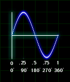
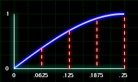
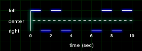
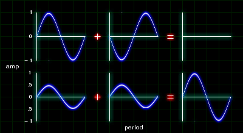
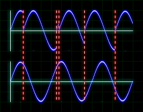
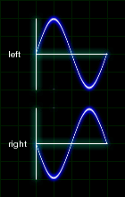
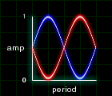

# Phase

## Initial Phase Value

In the OSCIL opcode, there is an optional fourth parameter to define the initial phase of your waveform. This option is important to know when designing legato instruments and eliminating nasty digital artifacts. The value range for the phase parameter is 0 to 1. If you specify a negative value such as -1, the next time the time this OSCIL is triggered, it will pick up from where it last left off, creating a smooth transition. The standard numerical values for phase range from 0 to 360 degress. 0 = 0', .25 = 90, .5 = 180, .75 = 270, 1 = 360(0).



Anytime a signal makes a significant jump from one value to the next, an artifact is introduced to the audio. If we start a sine wave with a value of 0, no artifact is introduced. As the initial phase value is incremented, the jump in the signal grows larger, creating a more noticable transient.



Listen for the transient attack as the starting phase grows from 0 to .25.

```csound
; 201.orc

instr 1
iphase  =  p4
 kenv1  linseg  1, p3 *.75, 1, p3 *.25, 0
 aosc1  oscil  32000 * kenv1, 262, 1, iphase
 out  aosc1
endin

; 201.sco

f1  0  8192  10  1

i1  1  1  0
i1  3  1  .0625
i1  5  1  .125
i1  7  1  .1875
i1  9  1  .25
```

## Initial Phase Value for Panning

A square wave is used to control the panning position of a sine wave. If we give it phase value of 0, the instument will start on the left when it is triggered. A value of .5 will cause the panning to start on the right side.



```csound
; 202.orc

instr 1
iphase  =  p4
 kosc1  oscil  1, 1, 2, iphase
 aosc1  oscil  10000, 262, 1
 outs  aosc1 * sqrt(1-kosc1), aosc1 * sqrt(kosc1)
endin

; 202.sco

f1  0  8192  10  1
f2  0  2  -2  0  1

i1  0  2  0
i1  3  2  .5
```

## Phase Cancellation

Audio signals out of phase can cause some frequencies to add or cancel out. In this first demonstration, we'll use the standard sine wave to show it at its most basic level. One signal has a fixed starting phase of 0, while the second signal starts at 0 and is incremented by .125 until it reaches 1. Both signals are mixed into a mono channel.

Figure 2.4 shows two waves 180 degrees out of phase that cause them cancel each other out. If the waves are in phase, then the signals add.



```csound
; 203.orc

instr 1
iphase  =  p4
 aosc1  oscil  10000, 440, 1
 aosc2  oscil  10000, 440, -1, iphase
 amix  =  aosc1 + aosc2
 out  amix
endin

; 203.sco

f1  0  8192  10  1

i1  0  2  0
i1  3  2  .125
i1  6  2  .25
i1  9  2  .375
i1  12  2  .5
i1  15  2  .625
i1  18  2  .75
i1  21  2  .875
i1  25  2  1
```

## Legato

To create a legato instrument with OSCIL, it is necessary to set the phase parameter to -1. By doing this, you are telling the oscillator to pick up from where it left off.

Figure 2.5 shows the difference between the phase parameter set to 0 versus set to -1. The wave always starts at 0 and rarely matches with the last ending point, causing artifcats to the sound.



In this example, the melody is played first with phase set to 0 and then phase set to -1.

```csound
; 204.orc

instr 1
iphase  =  p5
 aosc1  oscil  10000, cpspch(p4), 1, iphase
 out  aosc1
endin

; 204.sco

f1  0  8192  10  1

i1  0  .25  7.00  0
i1  +  .  .  .
i1  +  .  .  .
i1  +  .  7.02  .
i1  +  .  7.03  .
i1  +  .  .  .
i1  +  .  .  .
i1  +  .  7.05  .
i1  +  .333  7.07  .
i1  +  .  7.05  .
i1  +  .  7.03  .
i1  +  .  7.05  .
i1  +  .  7.03  .
i1  +  .  6.10  .
i1  +  1  7.00  .
s
f0  1
s
i1  0  .25  7.00  0
i1  +  .  .  -1
i1  +  .  .  .
i1  +  .  7.02  .
i1  +  .  7.03  .
i1  +  .  .  .
i1  +  .  .  .
i1  +  .  7.05  .
i1  .333  .  7.07  .
i1  +  .  7.05  .
i1  +  .  7.03  .
i1  +  .  7.05  .
i1  +  .  7.03  .
i1  +  .  6.10  .
i1  +  1  7.00  .
e
```

## Stereo Phase Manipulation

This example is almost identical as the phase cancellation example. The only difference is instead of combining the signals into one mono channel, the signals come out of seperate left and right channels. The signals will add or cancel depending where the listener is in proportion to the speakers. Place yourself so that your head is centered between the left and right speaker. Also try moving your head to left and right a few times. Use headphones as well.



You may want to take the time now to check to see if your speakers are properly set up. Make sure the red and black outputs from your stereo reciever are plugged into the matching red and black inputs of your speakers.

```csound
; 205.orc

instr 1
iphase  =  p4
 aosc1  oscil  10000, 262, 1
 aosc2  oscil  10000, 262, iphase
 outs  aosc1, aosc2
endin

; 205.sco

f1  0  8192  10  1

i1  0  2  0
i1  3  2  .125
i1  6  2  .25
i1  9  2  .375
i1  12  2  .5
i1  15  2  .625
i1  18  2  .75
i1  21  2  .875
i1  25  2  1
```

Here is a little extra bonus for you to try on your own. Take a mono soundfile (like a mono drum loop) and send it through left side unaltered and the right side multiplied by -1. Try it!

## Crossfading

To crossfade between two timbres, make a sine wave with an amplitude of .5. Bias this by .5, so that the signal will lie between the values 0 and 1. Mulitple this signal with one timbre. Then multiply the sine wave with a negate -1 and the second timbre. Add the results together and you'll have a patch that crossfades smoothly between two timbers. If you use this trick as a legato instrument, make sure to use the -1 in the initial phase parameter of both the control signal and audio signal.



```csound
; 206.orc

instr 1
idur  =  p3
iamp  =  p4
ipch  =  cpspch(p5)
 kenv1  expseg  1, idur * .25, 6, idur * .5, 6, idur * .25, 1
 kosc1  oscil  .5, kenv, 1, -1
 kosc2  =  kosc1 * -1
 kosc1  =  kosc1 + .5
 kosc2  =  kosc2 + .5
 aosc1  oscil  10000, ipch, 2, -1
 aosc2  oscil  10000, ipch, 3, -1
 amix  =  aosc1 * kosc1 + aosc2 * kosc2
 out  amix
endin


; 206.sco

f1  0  8192  10  1
f2  0  8192  10  1  0  1  0  1  0  1  0
f3  0  8192  10  0  1  0  1  0  1  0  1

i1  0  1  10000  7.04
i1  +  .  .  6.11
i1  +  2  .  6.04
i1  +  1  .  7.06
i1  +  .  .  7.01
i1  +  2  .  6.06
i1  +  2  .  7.04
```
