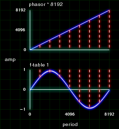
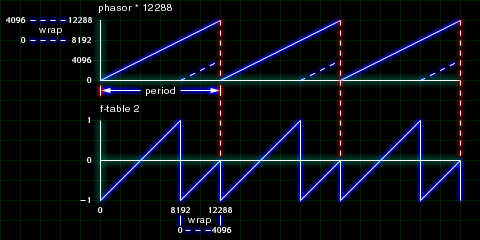
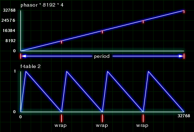
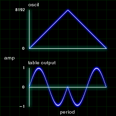

# The Phasor

The PHASOR in Csound is different from the effect phasor found in DSP or guitar fx boxes. Instead, it is a saw wave with value range of 0 to 1. The PHASOR can be used to read through a stored function table with the TABLE. This method gives us more options and more control over our wave generators than OSCIL. For example, we can simulate a Sync Oscillator with a PHASOR and we can synchronize multiple events reading from a single master PHASOR.

## Building an Oscillator with the Phasor

In the last section, I showed you that you can set the starting phase value of an oscillator. The value range is 0 to 1. Well... The PHASOR cycles from 0 to 1. So by taking a PHASOR and multiplying it by the size of a stored function table of 8192, the PHASOR will now cycle from 0 to 8192. The TABLE opcode allows you the user to point to any position in a stored function table. If our modified PHASOR is used to tell the TABLE where to point to, then we will be reading through our stored function table.



```csound
; 401.orc

instr 1
iamp  =  p4
ifreq  =  p5
 aphasor  phasor  ifreq
 atable  table  aphasor * 8192, 1,0 ,0, 1
 out  atable * iamp
endin

; 401.sco

f1  0  8192  10  1

i1  0  2  10000  262
```

This may seem like extra work to get the same effect as the OSCIL. But now you know a little bit more about how OSCIL works under the hood. Not to mention, there are plenty more things you can do with this trick you can't do with the OSCIL. Keep reading.

## Simulating a Sync Oscillator

The traditional analogue way of creating a sync oscillator has two main components, the master oscillator and the slave oscillator. The master oscillator defines the pitch of the singal by telling the slave to reset its cycle to the beginning. The frequency of the slave is independent of the master. When the master begins another cycle, the slave is forced to truncate its wavefrom and start at the beginning of its cycle. Thus, causing both the master and slave to have the same period length. The master is the control signal while the slave is the audio signal.

In Csound, we'll use the phasor technique to get near the same results. If we multiply our PHASOR by 12288 when our stored function table has a size of 8192, then the pointer will wrap itself around (providing the optional wrap argument in TABLE is on.) In other words, when the PHASOR is feeding values from 8193 to 12888 the TABLE pointer will actually be looking at 0 to 4096 in the stored function table.

In the figure below, the blue dotted lines point to the wrap around. The red dotted lines point to where the wave resets.



```csound
; 402.orc

instr 1
idur  =  p3
iamp  =  p4
ipch  =  cpspch(p5)
isync  =  p6
 aenv1  linseg  1, idur * .5, isync, idur * .5, 1
 aphasor  phasor  ipch
 atable  table3  aphasor * 8192 * aenv1, 1, 0,0, 1
 out  atable * iamp
endin

; 402.sco

f1  0  8192  7  -1  8192  1

i1  0  4  10000  6.00  8
i1  4  4  10000  6.05  16
```

This creates a very dirty sounding sync. Aliasing is to blame.

## Short Cuts to Creating Complex Rhythyms

Here is a very easy use of the PHASOR to create complex rhythms in Csound. Instead of using the PHASOR for audio purposes, we can also use it to cycle through control signals. Create a stored function table using GEN07 with a sharp attack and a long decay. Multiply the PHASOR by the size of the table (8192) and the number of times you want the rhythym to be triggered per beat. Multiply this TABLE with the amplitude of an OSCIL and you'll have yourself a very simple rhythmic instrumet. And its more user friendly in the score.



```csound
; 403.orc

instr 1
idur  =  p3
iamp  =  p4
ipch  =  cpspch(p5)
irate  =  p6
 aphasor  phasor  irate
 atable  table  aphasor * 8191, 2
 aosc1  oscil  iamp, ipch, 1, -1
 aosc1  =  aosc1 * atable
 out  aosc1
endin

; 403.sco

f1  0  8192  10  1  0  0  0  0  0  .5  0  0  .3  0  0  0  .2  0  0  .1
f2  0  8192  -7  0  192  1  200  .6  7800  0

i1  0  2  10000  7.00  4
i1  +  .  .  7.05  3
i1  +  .  .  7.02  8
i1  +  .  .  7.07  6
i1  +  .  .  7.00  .5

i1  12  2  10000  7.07  4
i1  +  .  .  .  4
i1  +  .  .  .  4
i1  +  .  .  .  4
i1  +  .  .  .  3
i1  +  .  .  .  2
i1  +  .  .  .  2
i1  +  .  .  .  8
i1  +  .  .  .  3
i1  +  .  .  .  12

i1  +  2  10000  7.072  2
i1  +  .  .  .  3
i1  +  .  .  .  8
i1  +  .  .  .  6
i1  +  .  .  .  6
i1  +  .  .  .  3
i1  +  .  .  .  6
i1  +  .  .  .  3
i1  +  .  .  .  12
i1  +  .  .  .  4
e
```

## Building a Phasor with OSCIL

Building a PHASOR is quite easy. Create an f-table with GEN 7 that rises from 0 to 1.

`f2 0 8192 7 0 8192 1`

Then use an OSCIL to cycle through this stored function table.

`aphasor oscil 1, 440, 2`

This is now identical to the PHASOR opcode.

## Building a Non-linear Phasor

The only difference in creating this versus the last example is that we'll make a different shape in our f-table. If the f-table stores a triangle waveform and applied to a TABLE, the TABLE will read to the end and back to the beginning of a stored wave during one period. Figure 4.4 shows visually what happen when you do this.



```csound

; 404.orc

instr 1
idur  =  p3
iamp  =  p4
ipch  =  cpspch(p5)
ishape  =  p6
 aclock  oscil  .5, ipch, ishape, -1
 aclock  =  aclock + .5
 atable  table  aclock * 8191, 1, 0,0, 1
 out  atable * iamp
endin

; 404.sco

f1  0  8192  10  1
f2  0  8192  -7  -1  4096  1  4096  -1

i1  0  2  10000  7.00  2
```
