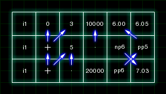
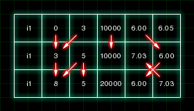
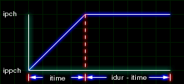
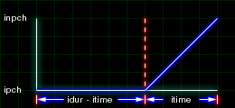

# Portamento and Glide

## Score Functions

In order to create a portamento or glide in Csound, you must first familiarize yourself with some of the score functions. The four functions to know are '+', '.', 'ppx' and 'npx'. The '+' adds the previous p-field 2 and previous p-field 3. The '.' carries the previous value from the same p-field. 'ppx' grabs a previous p-field value. 'npx' grabs a value from one of the next p-fields.

In figure 3.1, we have an example score using the score commands. The score commands point to other locations in the score and takes those values stored in these locations. Figure 3.2 show the results from the score commands.





## Portamento

Every time a new note is triggered in this Csound portamento instrument, an envelope is used to slide from the previous pitch and previous amplitude to the new pitch and amplitude. The 'ppx' command grabs values from the previous pitch and amplitude. The rise time is detemined by itime(p8).



```csound
; 301.orc

instr 1
idur  =  p3
iamp  =  p4
ipamp  =  p5
ipch  =  cpspch(p6)
ippch  =  cpspch(p7)
itime  =  p8

 kenv1  linseg  ipamp, itime, iamp, idur - itime, iamp
 kenv2  linseg  ippch, itime, iamp, idur - itime, ipch

 aosc1  oscil  lenv1, kenv2, 1, -1
 out  aosc1
endin

; 301.sco

f1  0  2  2  1  -1

i1  0  1  10000  0  7.04  7.04  1
i1  +  .  .  pp4  7.11  pp6  .

i1  +  .1666  .  pp4  8.04  pp6  .
i1  +  .  .  pp4  7.01  pp6  .
i1  +  .  .  pp4  7.09  pp6  .

i1  +  .  .  pp4  8.04  pp6  .05
i1  +  .  .  pp4  8.01  pp6  .
i1  +  .  .  pp4  7.09  pp6  .

i1  +  .  .  pp4  8.02  pp6  .
i1  +  .  .  pp4  7.11  pp6  .
i1  +  .  .  pp4  7.07  pp6  .

i1  +  1  .  pp4  8.07  pp6  .
i1  +  .5  .  pp4  8.06  pp6  .
i1  +  .  .  pp4  8.04  pp6  .
```

## Glide

The glide works on the very same principles found in the portamento instrument. The difference is that the note glides into the next note before it is played instead of sliding from the last pitch to the new pitch. To do this, we use the 'npx' command to read ahead to see what the next pitch and amplitude are.



```csound
; 302.sco

instr
idur  =  p3
iamp  =  p4
inamp  =  p5
ipch  =  cpspch(p6)
inpch  =  cpspch(p7)
itime  =  p8

 kenv1  linseg  iamp, idur - itime, iamp, itime, inamp
 kenv2  linseg  ipch, idur - itime, ipch, itime, inpch

 aosc1  oscil  kenv1, kenv2, 1, -1
 out  aosc1
endin

; 302.sco

f1  0  2  2  1  -1

i1  0  1  0  np4  7.04  np6  .5
i1  +  .  .  np4  7.11  np4  .1

i1  +  .1666  .  np4  8.04  np4  .05
i1  +  .  .  np4  7.01  np4  .
i1  +  .  .  np4  7.09  np4  .

i1  +  .  .  np4  8.04  np4  .05
i1  +  .  .  np4  8.01  np4  .
i1  +  .  .  np4  7.09  np4  .

i1  +  .  .  np4  8.02  np4  .
i1  +  .  .  np4  7.11  np4  .
i1  +  .  .  np4  7.07  np4  .

i1  +  1  .  np4  8.07  np4  .05
i1  +  .5  .  np4  8.06  np4  .
i1  +  .  .  0  8.04  8.04  .
```
