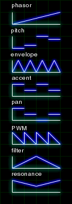
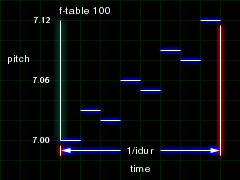
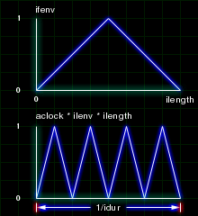
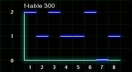
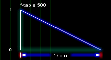
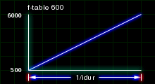
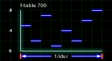

# Step Sequencer

Analogue sequencers are great because they force you to rethink the way you compose music. The interface of any synthesizer can have a significant influence on the music a person writes. With Csound, we design our own interfaces to use in our score. We determine how each instrument uses the p-fields.

Designing a step sequencer is no exception. Very little is actually required to build a step sequencer in Csound. This is also a great lesson for designing more elaborate instruments.

## How to Build a Step Sequencer

The method used for this instrument primarily uses a master PHASOR, f-tables and TABLE.

To properly sync everything in our step sequencer, we want to create a master PHASOR. Once the PHASOR is created, every component reads from this master phasor. You can think of the PHASOR as a master clock in some respects.

Let's take the time to add each component one at a time so that you can get a feel of how an instrument is built top down.



## Creating the Master Clock

The master clock is built from a PHASOR. The PHASOR run at '1/idur' in order to play all the notes once, regardless of the designated time length in p3. This also allows the user to specify different time lengths to easily change the tempo of a pattern.

Here, we created the PHASOR at an a-rate. A sister clock is created by taking our aclock and downsampling it to a k-rate using DOWNSAMP. This is done because not all the opcode parameters used can take an a-rate value. We could have created a seperate kclock and this would have worked just fine. This method here is a little bit more clean and effiecient.

aclock phasor 1/idur
kclock downsamp aclock

## FTLEN

If we are going to store notes in an f-table, we might as well take advantage of some of our availabe options that an f-table allows us. For instance, instead of designing a step-sequener that plays 16 notes each time no matter what, we can allow our step-sequencer play as many notes as we choose to put in our f-table. Maybe we want only to play 8 notes or maybe 32. FTLEN allows us to automate our instrument.

The FTLEN opcode seeks out an f-table and returns the size of that f-table.

```csound
f1 0 8192 10 1
f2 0 16 -2 1 2 3 4 5 6 7 8 9 10 11 12 13 14 15 16


isize = ftlen(1)
isize2 = ftlen(2)
```

The value that FTLEN gives to isize is 8192 and the value of isize2 is 16.

And we don't have to worry about standardizing our TABLE multiplier by a fixed number when generating an sound.

`atable table aphasor * 8192 ; standadized`
vs.
`atable table aphasor * isize ; now our ifn can be any size.`

## Variable Names Designed to Make Life Easier

Designing better instruments doesn't just mean how the instrument works internally, but also other details like what to name our variables. It's true we can name our variables anything we want, give them pet names or just a number value. Or we can name our variables to tell us useful information, like what the variable does.

In this instrument, I've organized the names of my variables so I will know more about how and where the variable was created.

```csound
f = function table
l = length
t = table
```

ex: ifenv

In know that ifenv is a fixed value. There is an f, so I know that the data in this variable come directly from an f-table found in the score. And I have env, to let me know that this variable is used for an envelope.

## The VCO

Instead of using an OSCIL to generate the audio, I'm using an opcode called VCO (voltage controlled oscillator.) This opcode has a built in saw wave, pulse width modulation and a triangle/saw. I've designed this instrument to use this opcode so that everytime the instrument is triggered, a different traditional waveform can be selected.

`iwave = p5 ; 1 = sawtooth, 2 = Square/PWM, 3 = triangle/Saw/Ramp`

This opcode allows us to easily change to traditional analogue wave shapes and to dynamically control the pulse width.

### Taking advantage of the f-table

We can use function tables for much more than creating waveshapes and storing envelope shapes. We can store data for anything we want. Storing a series of pitches in an f-table saves the user time when composing a piece. Using f-tables to store information such as pan position, resonance of a filter and pulse width modulation.

## Pitch Table

The pitch component grabs pitches from a stored function table in the score. The proper gen table to use for cases like this is GEN02. GEN02 allows the user to give a specific value for each point in the gen table. This is different from other GENs like GEN10 that use an algorithm to generate data and plot the data into the table. When creating the GEN, use -2. This causes the table not to rescale value range from -1 to 1.

In this instrument design, the length of the pitch table also determines the master length of the instrument stored in ilength by using FTLEN. This information is used by other components in the instrument. For example, if there are 8 pitches, 8 is used as a multiplier for the envelope component, so that the envelope cycles through 8 times (one envelope for each not.)



```csound
; 501.orc

instr 1
idur  =  p3
iamp  =  p4
iwave  =  p5
ifpch  =  p6
ilength  =  ftlen(ifpch)
 aclock  phasor  1/idur
 kclock  downsamp  aclock
 ktpch  table  kclock * ilength, ifpch, 0, 0, 1
 kpch  =  cpspch(ktpch)
 avco1  vco  1, kpch, iwave, .5, 1, 1/(cpspch(7.00))
 avco2  vco  1, kpch * .994, iwave, .5, 1, 1/(cpspch(7.00))
 avco  =  (avco1 + avco2) * .5 * iamp
 agate  linseg  0, .015625, 1, idur - .03125, 1, .015625, 0
 outs  avco * agate, avco * agate
endin

; 501.sco

f1  0  8192  10  1

f100  0  8  -2  7.00  7.03  7.02  7.06  7.05  7.09  7.08  7.12

t  0  90

i1  0  4  10000  2  100
i1  +  2  10000  1  100
i1  +  2  10000  1  100
e
```

## Envelope

The envelope component works by taking an envelope shape stored in an f-table and cycling through it for as many notes as there are in the pitch table. Notice that one of the TABLE multipliers is ilength.

The other multiplier is ilenv. ilenv tells us the size of the f-table which the envelope resides. This is very convienient for the user because he or she doesn't have to worry about making sure the f-table size is always at a constant 256. All stored envelopes can be of different length without breaking the instrument.

`atenv table aclock * ilenv * ilength , ifenv, 0, 0, 1`



```csound
; 502.orc

instr 1
idur  =  p3
iamp  =  p4
iwave  =  p5
ifpch  =  p6
ifenv  =  p7
ilength  =  ftlen(ifpch)
ilenv  =  ftlen(ifenv)
 aclock  phasor  1/idur
 kclock  downsamp  aclock
 ktpch  table  kclock * ilength, ifpch, 0, 0, 1
 atenv  table  aclock * ilenv * ilength, ifenv, 0,0, 1
 kpch  =  cpspch(ktpch)
 avco1  vco  1, kpch, iwave, .5, 1, 1/(cpspch(7.00))
 avco2  vco  1, kpch * .994, iwave, .5, 1, 1/(cpspch(7.00))
 avco  =  (avco1 + avco2) * .5 * iamp * atenv
 agate  linseg  0, .015625, 1, idur - .03125, 1, .015625, 0
 outs  avco * agate, avco * agate
endin

; 502.sco

f1  0  8192  10  1

f100  0  8  -2  7.00  7.03  7.02  7.06  7.05  7.09  7.08  7.12
f101  0  4  02  6.04  6.08  6.11  7.04

f200  0  8192  -7  0  4096  1  0  4096
f201  0  256  -5  .001  64  1  192  .001

t  0  90

i1  0  4  10000  2  101  200
i1  +  2  10000  1  100  .
i1  +  2  10000  1  101  201
i1  +  1  10000  1  101  201
i1  +  1  10000  1  101  201
e
```

## Accents

The accent table is used to give more agressive dynamics to our instrument. It works by using the values of an f-table as multipliers to the amplitude. A value of 1 means the note will be played approximately at our specified amplitude. A value of 2 will play the note at twice the amplitude. The accents are multiplied with the specified amplitude (iamp.)

In this instrument, I designed the accent to work so that if the accent table is smaller than the pitch table, it will wrap around to the beginning once it reaches the end. If there are 16 pitches and 4 points of data in the accent table, then the accent table is played 4 times through to correspond to the 16 pitches.



```csound
; 503.orc

instr 1
idur  =  p3
iamp  =  p4
iwave  =  p5
ifpch  =  p6
ifenv  =  p7
iacc  =  p8
ilength  =  ftlen(ifpch)
ilenv  =  ftlen(ifenv)
 aclock  phasor  1/idur
 kclock  downsamp  aclock
 ktpch  table  kclock * ilength, ifpch, 0, 0, 1
 atenv  table  aclock * ilenv * ilength, ifenv, 0,0, 1
 atacc  table  aclock * ilength, ifacc, 0, 0, 1
 kpch  =  cpspch(ktpch)
 avco1  vco  1, kpch, iwave, .5, 1, 1/(cpspch(7.00))
 avco2  vco  1, kpch * .994, iwave, .5, 1, 1/(cpspch(7.00))
 avco  =  (avco1 + avco2) * .5 * iamp * atenv * atacc
 agate  linseg  0, .015625, 1, idur - .03125, 1, .015625, 0
 outs  avco * agate, avco * agate
endin

; 503.sco

f1  0  8192  10  1

f100  0  8  -2  7.00  7.03  7.02  7.06  7.05  7.09  7.08  7.12
f101  0  4  02  6.04  6.08  6.11  7.04

f200  0  8192  -7  0  4096  1  0  4096
f201  0  256  -5  .001  64  1  192  .001

f300  0  8  -2  2  1  2  1  1  2  0  1
f301  0  4  -2  2  1  1  1
f302  0  8  -2  2  0  1  0  1  0  2  0

t  0  90

i1  0  4  10000  2  101  200  301
i1  +  2  10000  1  100  200  300
i1  +  2  10000  1  101  201  301
i1  +  1  10000  1  100  201  300
i1  +  1  10000  1  100  201  302
e
```

## Pan Position

The pan component works very similiar to that of the accent component. The value range for pan is from 0 to 1. At 0, the note will be played out of the left channel. At 1, the note will be played out of the right channel.


```csound
; 504.orc

instr 1
idur  =  p3
iamp  =  p4
iwave  =  p5
ifpch  =  p6
ifenv  =  p7
iacc  =  p8
ipan  =  p9
ilength  =  ftlen(ifpch)
ilenv  =  ftlen(ifenv)
 aclock  phasor  1/idur
 kclock  downsamp  aclock
 ktpch  table  kclock * ilength, ifpch, 0, 0, 1
 atenv  table  aclock * ilenv * ilength, ifenv, 0,0, 1
 atacc  table  aclock * ilength, ifacc, 0, 0, 1
 atpan  table  aclock * ilength, ifpan, 0, 0, 1
 kpch  =  cpspch(ktpch)
 avco1  vco  1, kpch, iwave, .5, 1, 1/(cpspch(7.00))
 avco2  vco  1, kpch * .994, iwave, .5, 1, 1/(cpspch(7.00))
 avco  =  (avco1 + avco2) * .5 * iamp * atenv * atacc
 agate  linseg  0, .015625, 1, idur - .03125, 1, .015625, 0
 outs  avco * (sqrt(1-atpan)) * agate, avco * sqrt(atpan) * agate
endin

; 504.sco

f1  0  8192  10  1

f100  0  8  -2  7.00  7.03  7.02  7.06  7.05  7.09  7.08  7.12
f101  0  4  02  6.04  6.08  6.11  7.04

f200  0  8192  -7  0  4096  1  0  4096
f201  0  256  -5  .001  64  1  192  .001

f300  0  8  -2  2  1  2  1  1  2  0  1
f301  0  4  -2  2  1  1  1
f302  0  8  -2  2  0  1  0  1  0  2  0

f400  0  7  -2  1  0  1  .25  .75  0  .5  .25

t  0  90

i1  0  4  10000  2  101  200  301  400
i1  +  2  10000  1  100  200  300  .
i1  +  2  10000  1  101  201  301  .
i1  +  2  10000  1  100  201  300  .
i1  +  2  10000  1  100  201  302  .
e
```

## PWM

This feature only works on waveforms 2 (Square/PWM) and 3 (triangle/Saw/Ramp.) The PWM works the same as the envelope component.



```csound
; 505.orc

instr 1
idur  =  p3
iamp  =  p4
iwave  =  p5
ifpch  =  p6
ifenv  =  p7
iacc  =  p8
ipan  =  p9
ifpwm  =  p10
ilength  =  ftlen(ifpch)
ilenv  =  ftlen(ifenv)
ilpwm  =  ftlen(ifpwm)
 aclock  phasor  1/idur
 kclock  downsamp  aclock
 ktpch  table  kclock * ilength, ifpch, 0, 0, 1
 atenv  table  aclock * ilenv * ilength, ifenv, 0,0, 1
 atacc  table  aclock * ilength, ifacc, 0, 0, 1
 atpan  table  aclock * ilength, ifpan, 0, 0, 1
 ktpwm  table  kclock * ilpwm * ilength, ifpwm, 0, 0, 1
 kpch  =  cpspch(ktpch)
 avco1  vco  1, kpch, iwave, ktpwm, 1, 1/(cpspch(7.00))
 avco2  vco  1, kpch * .994, iwave, ktpwm, 1, 1/(cpspch(7.00))
 avco  =  (avco1 + avco2) * .5 * iamp * atenv * atacc
 agate  linseg  0, .015625, 1, idur - .03125, 1, .015625, 0
 outs  avco * (sqrt(1-atpan)) * agate, avco * sqrt(atpan) * agate
endin

; 505.sco

f1  0  8192  10  1

f100  0  8  -2  7.00  7.03  7.02  7.06  7.05  7.09  7.08  7.12
f101  0  4  02  6.04  6.08  6.11  7.04

f200  0  8192  -7  0  4096  1  0  4096
f201  0  256  -5  .001  64  1  192  .001

f300  0  8  -2  2  1  2  1  1  2  0  1
f301  0  4  -2  2  1  1  1
f302  0  8  -2  2  0  1  0  1  0  2  0

f400  0  7  -2  1  0  1  .25  .75  0  .5  .25

f500  0  8192  -7  1  8192  0
f501  0  8192  -7  1  4096  0  4096  1

t  0  90

i1  0  4  10000  2  101  200  301  400  501
i1  +  2  10000  .  100  200  300  .  500
i1  +  4  10000  .  101  201  301  .  .
i1  +  2  10000  .  100  201  300  .  501
i1  +  2  10000  .  100  201  302  .  .
e
```

## MOOGVCF - Voltage Control Filter

The way this component is designed allows each note to have its own lowpass filter setting, or an evolving low pass filter that spands the duration of the instrument. If there are 16 pitches, and there are 16 values in the filter table, then each note will correspond to its filter amount. If the filter has 8192 points and is created so that it is in envelope form, the lowpass filter will simulate a turn of the knob.



```csound
; 506.orc

instr 1
idur  =  p3
iamp  =  p4
iwave  =  p5
ifpch  =  p6
ifenv  =  p7
iacc  =  p8
ipan  =  p9
ifpwm  =  p10
ifvcf  =  p11
ilength  =  ftlen(ifpch)
ilenv  =  ftlen(ifenv)
ilpwm  =  ftlen(ifpwm)
ilvcf  =  ftlen(ifvcf)
 aclock  phasor  1/idur
 kclock  downsamp  aclock
 ktpch  table  kclock * ilength, ifpch, 0, 0, 1
 atenv  table  aclock * ilenv * ilength, ifenv, 0,0, 1
 atacc  table  aclock * ilength, ifacc, 0, 0, 1
 atpan  table  aclock * ilength, ifpan, 0, 0, 1
 ktpwm  table  kclock * ilpwm * ilength, ifpwm, 0, 0, 1
 atvcf  table  aclock * ilvcf, ifvcf, 0, 0, 1
 kpch  =  cpspch(ktpch)
 avco1  vco  1, kpch, iwave, ktpwm, 1, 1/(cpspch(7.00))
 avco2  vco  1, kpch * .994, iwave, ktpwm, 1, 1/(cpspch(7.00))
 avco  =  (avco1 + avco2) * .5
 avcf  moogvcf  avco, atvcf, 0
 avcf  =  avcf * iamp * atenv * atacc
 agate  linseg  0, .015625, 1, idur - .03125, 1, .015625, 0
 outs  avcf * (sqrt(1-atpan)) * agate, avcf * sqrt(atpan) * agate
endin

; 506.sco

f1  0  8192  10  1

f100  0  8  -2  7.00  7.03  7.02  7.06  7.05  7.09  7.08  7.12
f101  0  4  02  6.04  6.08  6.11  7.04

f200  0  8192  -7  0  4096  1  0  4096
f201  0  256  -5  .001  64  1  192  .001

f300  0  8  -2  2  1  2  1  1  2  0  1
f301  0  4  -2  2  1  1  1
f302  0  8  -2  2  0  1  0  1  0  2  0

f400  0  7  -2  1  0  1  .25  .75  0  .5  .25

f500  0  8192  -7  1  8192  0
f501  0  8192  -7  1  4096  0  4096  1

f600  0  8192  -7  500  8192  6000
f601  0  8  -2  6000  500  1000  200  4000  2000  1000  500

t  0  90

i1  0  4  10000  1  101  200  301  400  501  600
i1  +  2  10000  .  100  200  300  .  500  .
i1  +  4  10000  .  101  201  301  .  .  .
i1  +  4  10000  .  100  201  300  .  501  601
i1  +  4  10000  .  100  201  302  .  .  .
e
```

## Resonance

The resonance works the same as a Voltage Control Filter. The workable range is 0 to about 1. As the value approaches 1, the filter starts to self oscillate, adding a TB303 quality to the sound.



```csound
; 507.orc

instr 1
idur  =  p3
iamp  =  p4
iwave  =  p5
ifpch  =  p6
ifenv  =  p7
iacc  =  p8
ipan  =  p9
ifpwm  =  p10
ifvcf  =  p11
ifres  =  p12
ilength  =  ftlen(ifpch)
ilenv  =  ftlen(ifenv)
ilpwm  =  ftlen(ifpwm)
ilvcf  =  ftlen(ifvcf)
ires  =  ftlen(ifres)
 aclock  phasor  1/idur
 kclock  downsamp  aclock
 ktpch  table  kclock * ilength, ifpch, 0, 0, 1
 atenv  table  aclock * ilenv * ilength, ifenv, 0,0, 1
 atacc  table  aclock * ilength, ifacc, 0, 0, 1
 atpan  table  aclock * ilength, ifpan, 0, 0, 1
 ktpwm  table  kclock * ilpwm * ilength, ifpwm, 0, 0, 1
 atvcf  table  aclock * ilvcf, ifvcf, 0, 0, 1
 atres  table  aclock * ilpwm * ilength, ifpwm, 0, 0, 1
 kpch  =  cpspch(ktpch)
 avco1  vco  1, kpch, iwave, ktpwm, 1, 1/(cpspch(7.00))
 avco2  vco  1, kpch * .994, iwave, ktpwm, 1, 1/(cpspch(7.00))
 avco  =  (avco1 + avco2) * .5
 avcf  moogvcf  avco, atvcf, atres
 avcf  =  avcf * iamp * atenv * atacc
 agate  linseg  0, .015625, 1, idur - .03125, 1, .015625, 0
 outs  avcf * (sqrt(1-atpan)) * agate, avcf * sqrt(atpan) * agate
endin

; 507.sco

f1  0  8192  10  1

f100  0  8  -2  7.00  7.03  7.02  7.06  7.05  7.09  7.08  7.12
f101  0  4  02  6.04  6.08  6.11  7.04

f200  0  8192  -7  0  4096  1  0  4096
f201  0  256  -5  .001  64  1  192  .001

f300  0  8  -2  2  1  2  1  1  2  0  1
f301  0  4  -2  2  1  1  1
f302  0  8  -2  2  0  1  0  1  0  2  0

f400  0  7  -2  1  0  1  .25  .75  0  .5  .25

f500  0  8192  -7  1  8192  0
f501  0  8192  -7  1  4096  0  4096  1

f600  0  8192  -7  500  8192  6000
f601  0  8  -2  6000  500  1000  200  4000  2000  1000  500

f700  0  8  -2  .5  .2  .7  .1  .4  .2  .6  .8
f701  0  8192  -7  .9  8192  0
f702  0  8192  -5  .8  4096  .2  4096  .8

t  0  90

i1  0  4  10000  1  101  200  301  400  501  600  701
i1  +  2  10000  .  100  200  300  .  500  .  700
i1  +  4  10000  .  101  201  301  .  .  .  701
i1  +  4  10000  .  100  201  300  .  501  601  702
i1  +  4  10000  .  100  201  302  .  .  .  .
e
```
