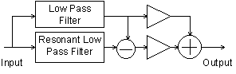

# A Csound Multi-Effects Processor

by Hans Mikelson

## Introduction

This chapter describes a Csound implementation of a multi-effects processor. Several categories of effects are presented including dynamics processing, filtering and pitch effects. Robin Whittle's zak opcodes provide a flexible method of routing between the effects routines. The pluck opcode is used to demonstrate these effects since many of them are often used with guitar.

## The Zak System

Communication between effects is handled by the zak opcodes. One advantage of the zak system over global variables is that communications between instruments may be reconfigured in the score without making changes to the orchestra. To utilize the zak opcodes they must first be initialized which is done with the following statement: zakinit num-a-rate, num-k-rate where num-a-rate and num-k-rate are the number of audio rate and control rate channels allocated.

Communications between effects are accomplished using zaw and zar. To write to an audio channel zaw asig, ichannel is used. To read from an audio channel asig zar ichannel is used. Here asig is the audio signal and ichannel is the number of the channel.

The zawm opcode mixes the current contents of the audio channel with the new audio data. During a chord several instances of the pluck instrument are active at the same time so the pluck instrument uses zawm to accumulate sound. The audio channels must be cleared every sample period or the data will continue to accumulate. The mixer is the last instrument in the orchestra and is used to clear audio channels 0-30 with the statement zacl 0, 30.

## Mixer

The mixer reads from four audio channels and provides independent gain and pan control for each channel.

```csound
asig1  zar      p4
igl1   init     p5*p6
igr1   init     p5*(1-p6)
asig2  zar      p7
igl2   init     p8*p9
igr2   init     p8*(1-p9)
asig3  zar      p10
igl3   init     p11*p12
igr3   init     p11*(1-p12)
asig4  zar      p13
igl4   init     p14*p15
igr4   init     p14*(1-p15)
asigl  =        asig1*igl1+asig2*igl2+asig3*igl3+asig4*igl4
asigr  =        asig1*igr1+asig2*igr2+asig3*igr3+asig4*igr4
```

## Dynamics Processing

This section describes a compressor, a limiter, a noise gate, a de-esser and a distortion effect.1 These are all related effects which change the dynamics of the sound.

### Compressor

A compressor is used to reduce the dynamic range of a signal. It does this by monitoring the level of an input signal and varying the gain applied to the output signal. Sounds greater than a specified level are reduced in volume. The rms opcode can be used to give a time average of the level of the input signal. The output from rms is used to reference a table which determines the amount of gain applied to the output signal. A post gain is usually included to restore the level of the output signal after it has been compressed. The rms opcode does not respond immediately to changes in level so that sudden attacks are sometimes allowed to pass. To avoid this the original signal is monitored and compression is applied to a time delayed copy of the signal. In this example a delay time equal to one half of the rms averaging time is used.

```csound
asig   zar      iinch                  ;Read input
kamp   rms      asig, ifqc             ;Find rms level
kampn  =        kamp/30000             ;Normalize rms
kcomp  tablei   kampn,itab,1,0         ;Look up compress.
adel1  delayr   ideltm                 ;Delay for ideltm
       delayw   asig                   ;Write to delay
acomp  =        kcomp*adel1*ipostgain  ;Apply compression
       zaw      acomp*kenv, ioutch     ;declick & output
```

The amount of compression is given by the compression curve f6. Compression levels of 2:1 and 4:1 are common.

`f6 13 1025 7 1 256 1 256 .5 513 .5`

The compressor block diagram is presented in figure 1.


### Limiter

The limiter is merely a compressor with a very severe compression curve. Limiters prevent a signal level from going above a specified limit. Limiters commonly use compression levels of 10:1 or 100:1. This can be implemented by simply using a different compression table:

`f6 13 1025 7 1 256 1 512 .01 129 .01`

### Noise Gate

Noise gates are used to remove unwanted background noise and hiss from a signal. A noise gate can be implemented by changing the f6 table again.

`f6 13 1025 7 0 64 0 0 1 448 1 513 1`

In this case signals below a certain level are completely silent. Once they exceed that level they are allowed to pass. Noise gates are sometimes criticized for removing playing dynamics. To solve this problem a delayed signal is used to determine the level and the original signal is modified and output. This results in the gate opening just before playing begins. This technique can also be used on a compressor to prevent compression of initial playing dynamics.


```csound
asig   zar      iinch                  ;Read from input
adel1  delayr   ideltm                 ;Delay the signal
       delayw   asig
kamp   rms      adel1, ifqc            ;Calculate RMS
kampn  =        kamp/30000             ;Normalize to 0-1
kcomp  tablei   kampn,itab,1,0         ;Reference the table
acomp  =        kcomp*asig*ipostgain   ; Apply noise gate
       zaw      acomp*kenv, ioutch     ;Declick and write
```

### De-Esser

The next effect considered in this section is the de-esser. Certain consonant sounds such as 's' and 'p' produce loud artifacts when a microphone is used. The de-esser is a relative of the compressor which can be used to reduce these artifacts. The de-esser monitors the level of the high frequency component of the signal and applies compression to the signal based on this level. This can be implemented by applying a high pass filter to the input signal and monitoring the level of the filtered signal.


```csound
asig   zar        iinch                  ;Read input
afilt  butterhp   asig, ifco             ;High pass filter
kamp   rms        afilt, ifqc            ;Calculate rms
kampn  =          kamp/30000             ;Normalize rms 0-1
kcomp  tablei     kampn,itab,1,0         ;Look up in table
adel1  delayr     ideltm                 ;Delay signal
       delayw     asig
acomp  =          kcomp*adel1*ipostgain  ;Apply de-ess
       zaw        acomp*kenv, ioutch     ;Declick & output
```

## Distortion

This section describes a distortion effect. An amplifier can be considered as having two operating ranges: a linear range, and a non-linear range. In the linear range of operation the output signal is an amplified copy of the input signal. In the non-linear range of operation the output signal is a distorted version of the input signal. Early electronic amplifiers were based on vacuum tubes. Vacuum tube distortion is usually described as warmer and more musical than other types of distortion.2

If a sine wave signal is passed through an overdriven tube amplifier the resulting waveform differs from the original in several ways. The top of the waveform becomes flattened or clipped. The bottom of the waveform is also flattened although not as much as the top. The duty cycle of the waveform is also shifted so that the upper part of the curve is not the same width as the lower part of the curve. The resulting shape is approximated in figure 1.


Waveform of a sine wave processed through a tube amplifier.

Waveshaping may be used to reshape the input waveform to resemble figure 4. For slight distortion use the following table:

`f5 0 8192 8 -.8 336 -.78 800 -.7 5920 .7 800 .78 336 .8`

For heavy distortion use the following table:

`f5 0 8192 7 -.8 934 -.79 934 -.77 934 -.64 1034 -.48 520 .47 2300 .48 1536 .48`

A shifted duty cycle can be accomplished by implementing an amplitude dependent delay line.


```csound
asigin  zar      izin
aold    =        asig
asig    =        igaini*asigin/60000
aclip   tablei   asig,5,1,.5
aclip   =        igainf*aclip*15000
atemp   delayr   .1
adel1   deltapi  (2-iduty*asig)/1500+islope*(asig-aold)/300
        delayw   aclip
        zaw      adel1, izout
```

## Filtering Effects

This section describes an equalizer, a wah-wah and a resonant low pass filter.

### Equalizer

An equalizer can be used to increase or decrease the level of different frequencies in a signal. In this example a three band equalizer is implemented. The butterlp and butterhp opcodes are used to isolate the low and high frequency components of the signal. The midrange component is isolated by high pass filtering above the low pass cut off frequency and low pass filtering below the high pass cut off frequency. Individual gains are applied to each of the three signal components before they are added together and output.


```csoudn
alosig   butterlp   asig, ilofco             ;Low pass
atmpsig  butterhp   asig, ilofco-ilofco/4    ;Midrange 1
amidsig  butterlp   atmpsig,                 ;Midrange 2
                    ihifco+ihifco/4
ahisig   butterhp   asig, ihifco             ;Hi pass
aout     =    ilogain*alosig+imidgain*amidsig+ihigain*ahisi
              g
```

### Wah-Wah

A wah-wah pedal is a type of low-pass filter which incorporates several resonances to give it a unique character. In this example several resonances derived from vowel sounds "ahh" and "ooh" are used to add character to the standard low pass filter sound. The vowel "ahh" has resonances and amplitudes of 730 Hz -1 db, 1090 Hz -5 db, 2440 Hz -28 db. The vowel "ooh" has resonances of 300 Hz -3 db, 870 Hz -19 db, 2240 Hz -43 db. As the frequency is swept from high to low the resonances are swept from "ahh" to "ooh."


```csound
kosc1     oscil     .5,irate,itab1,.25    ;Oscilator
kosc2     =         kosc1 + .5            ;Rescale for 0-1
kosc3     =         kosc2                 ;Formant Depth 0-1
klopass   =         idepth*kosc2+ilow     ;Filter range
kform1    =         430*kosc2 + 300       ;Formant 1 range
kamp1     =         ampdb(-2*kosc3 + 59)*ifmix  ;F1 level
kform2    =         220*kosc2 + 870             ;F2 range
kamp2     =         ampdb(-14*kosc3 +           ;F2 level
                    55)*ifmix
kform3    =         200*kosc2 + 2240            ;F3 range
kamp3     =         ampdb(-15*kosc3 +           ;F3 level
                    32)*ifmix
afilt     butterlp  asig, klopass               ;Low pass
ares1     reson     afilt, kform1, kform1/8     ;Apply
ares2     reson     afilt, kform2, kform1/8     ;formant
ares3     reson     afilt, kform3, kform1/8     ;filters 1-3
aresbal1  balance   ares1, afilt                ;Restore
aresbal2  balance   ares2, afilt                ;balance
aresbal3  balance   ares3, afilt
aout      =         afilt+kamp1*aresbal1        ;Add signals
aout      =         aout+kamp2*aresbal2+kamp3*aresbal3
```

### Resonant Low Pass Filter

Some theory of resonant filters can be found in the chapter "Classic Keyboard Instruments" and will not be discussed here in detail. This implementation uses the nlfilt opcode which avoids the need of setting kr=sr and also provides for simpler code. This filter is designed to resonate for approximately the same amount of time no matter what the cut-off frequency is.



```csound
kfco    oscil    1,1/idur,itab1 ;Cut-off frequency sweep
kfcort  =        sqrt(kfco)  ;by table 1
krezo   oscil    1,1/idur,itab2 ;Resonance sweep
krez     =       krezo*kfco/500 ;by table 2
kamp    linseg   0, .002, 1, p3-.004, 1, .002, 0  ;Declick
axn     zar      izin
ka1     =        1000/krez/kfco-1 ;Resonant lp filter
ka2     =        100000/kfco/kfco
kb      =        1+ka1+ka2
ay1     nlfilt   axn/kb, (ka1+2*ka2)/kb, -ka2/kb, 0, 0, 1
ay      nlfilt   ay1/kb, (ka1+2*ka2)/kb, -ka2/kb, 0, 0, 1
ka1lp   =        1000/kfco-1  ;Low pass filter
ka2lp   =        100000/kfco/kfco
kblp    =        1+ka1lp+ka2lp
ay1lp   nlfilt   axn/kblp,(ka1lp+2*ka2lp)/kblp,ka2lp/kblp,0,
                 0,1
aylp    nlfilt   ay1lp/kblp,(ka1lp+2*ka2lp)/kblp,ka2lp/kblp,
                 0,0,1
ayrez   =        ay - aylp  ;Extract the resonance
ayrz    =        ayrez/kfco  ;Adjust res. gain
ay2     =        aylp*6*ilpmix + ayrz*300*irzmix ;Mix Q &
                 LP
```

## Pitch Effects

This section describes vibrato, pitch shifting, chorus and flanging effects. All of these effects make use of delay lines whose delay times are modulated with an oscillator. An interpolating delay tap, deltapi, is used to allow continuous variation of the delay time.

### Vibrato

Vibrato can be accomplished by modulating a variable delay tap with a sine wave. When the delay tap sweeps forward in the same direction as the signal the pitch is lowered. As the delay tap sweeps backwards in the opposite direction of the signal the pitch is raised.


```csound
asig   zar       izin
kosc   oscil     iamp, ifqc, itab1
atemp  delayr    imax
aout   deltapi   kosc+imax/2
       delayw    asig
       zaw       aout, izout
```

### Pitch Shifting

A simple type of pitch shifting can be implemented with a variable length interpolating delay tap. The delay time is modulated with a sawtooth wave whose amplitude is equal to the wavelength of the sound. This results in a resampling of the wave form with linear interpolation between successive samples. Lowering the pitch results in cycles being discarded periodically. Raising the pitch results in some cycles being repeated. In order to produce a good quality sample the wavelength of the sound must be known. In this example it is simply supplied when the instrument is called.


```csound
klfo   oscil     1/kfqc, ipsh*kfqc, itab1
atemp  delayr    1/ifqc
atap1  deltapi   klfo
       delayw    aosc
```

### Chorus

Chorus is an effect which attempts to make one instrument sound like more than one instrument. The resulting sound is thicker than the original sound. Chorus can be implemented by adding the original signal to a frequency modulated delayed signal3. The signal is typically delayed between 20 and 30 msec. Gain is applied to control the amount of mix between the original signal and the delayed signal. Common waveforms used to modulate the signal are sine, triangle and logarithmic waves.


```csound
kamp    linseg   0, .002, 1, p3-.004, 1, .002, 0
asig   zar       izin
aosc1  oscil     idepth, irate, iwave, iphase
aosc2  =         aosc1+ideloff
atemp  delayr    idepth+ideloff
adel1  deltapi   aosc2
       delayw    asig
aout   =         (adel1*imix+asig)/2*kamp
       zaw       aout, izout
```

A stereo chorus effect can be created by having two choruses one quarter cycle out of phase of each other and sending the output of each to a separate channel. Many choruses can be combined with different phases, waveforms and delay times to produce a very rich sound.

```csound
;   Sta Dur Rate Depth Wave Mix Delay Phase InCh OutCh
i35 2   1.6 .5   2     1    1   25    0     2    3
i35 2   1.6 .5   2     1    1   20    .25   2    4
```

### Flanger

Flanging was originally produced by taking two tapes with the same music on them and playing at them at the same time. By pushing on the flanges of one of the tape reels the playback speed of one of the copies of the sound was modulated. This detuning of the signal results in areas of constructive and destructive interference as the different frequencies move in and out of phase with each other. This produces notches in the audio spectrum. As the frequency of the modulated signal is swept back and forth these notches move closer together and farther apart. This produces the characteristic "jet airplane" effect. In this implementation the original signal is added to a delayed signal. The delay time is modulated by a sine wave so that the pitch of the delayed signal is modulated. The combined signal is then fed back into the beginning of the delay path which makes a more pronounced flanging effect. Typical delay times are 10 msec.


```csound
asig1  =         asig+ifdbk*adel1
aosc1  oscil     idepth, irate, iwave, iphase
aosc2  =         aosc1+ideloff
atemp  delayr    idepth+ideloff
adel1  deltapi   aosc2
       delayw    asig1
aout   =         (imix*adel1+asig)/2
```

A stereo flanger can be implemented by running two flangers at one quarter cycle out of phase from each other and sending each to a separate channel as follows:

```csound
;   Sta Dur Rate Depth Wave Feedbk Mix Delay Phase InCh OutCh
i30 4   1.6 .5   1     1    .8     1   1     0     2    3
i30 4   1.6 .5   1     1    .8     1   1    .25    2    4
```

## Miscellaneous Effects

This section describes a digital delay, a panner, a tremolo effect and simple reverb effect.

### Stereo Delay

This section describes a stereo delay with cross feedback. The delayr and delayw opcodes provide a straight forward implementation of this. The right and left channels are delayed independently. The delayed signal from each channel may be mixed with the original signal either channel.


```csound
aoutl   init     0
aoutr   init     0
asigl   zar      izinl
asigr   zar      izinr
aoutl   delayr   itim1
        delayw   asigl+ifdbk1*aoutl+ixfdbk1*aoutr
aoutr   delayr   itim2
        delayw   asigr+ifdbk2*aoutr+ixfdbk2*aoutl
        zaw      aoutl, izoutl
        zaw      aoutr, izoutr
```

### Tremolo

Tremolo is usually considered to be a periodic variation in the volume of a sound. This can be implemented by generating a low frequency oscillating sine wave between 0 and 1 in amplitude and simply multiplying the input signal by this.


```csound
kosc   oscil  iamp, ifqc, itab1
aout   =      asig*(kosc+1)
```

A square wave can be used to generate an amplitude gated sound.

### Panner

A panner can be implemented by multiplying one channel by a low frequency sine wave and multiplying the other channel by one minus the low frequency sine wave so that the channels are 180 degrees out of phase with each other. This way the signal is swept from one channel to the other by the oscillator.


```csound
asig   zar     izin
kosc   oscil   iamp, ifqc, itab1
kpanl  =       (kosc+1)/2
kpanr  =       1-kpanl
aoutl  =       asig*kpanl
aoutr  =       asig*kpanr
       zaw     aoutl, izoutl
       zaw     aoutr, izoutr
```

### Reverb

All sound produces some type of reverberation as the sound waves are reflected and absorbed on surfaces in the listening environment. The type of reverb depends on the size, shape and material of the area in which the sound is produced. A concert hall can produce a very rich spacious reverb. Artificial reverb is often added to signals to make them sound as if they were generated in a specific type of area such as a concert hall. Reverberation can be simulated by using a combination of all pass filters, comb filters and delays. Csound provides a reverb2 opcode for generating simple reverbs. This is used in the following instrument to create a very simple reverb. There are many excellent examples of reverb available in the Csound archives which can be modified to work with the system presented in this chapter.

```csound
asig  zar     izin
aout  reverb2 asig, irvtime, irvfqc
      zaw     aout/5, izout
```

## Conclusion

Hopefully this section has provided insight into the theory and implementation of many of the most popular sound effects and has provided inspiration for further audio experiments. Some further ideas to try would be to use different waveforms with the pitch based effects, try calling the chorus routine many times with different parameters and waveforms to produce a dense chorusing effect. Try setting up different types of distortion and then devise an instrument to oscillate between them. Add attack and decay envelopes to the dynamics effects. If you have a fast computer one of the first things you may wish to do is to implement real-time input and output for the effects.

References

1. Lehman, S. Effects Explained. <http://www.harmony-central.com/Effects/>.
1. Hamm, R., O. "Tubes Versus Transistors - Is There an Audible Difference?", Journal of the Audio Engineering Society, May 1973.
1. Cronin, Dennis "Examining Audio DSP Programs," Dr. Dobb's Journal, July 1994.
